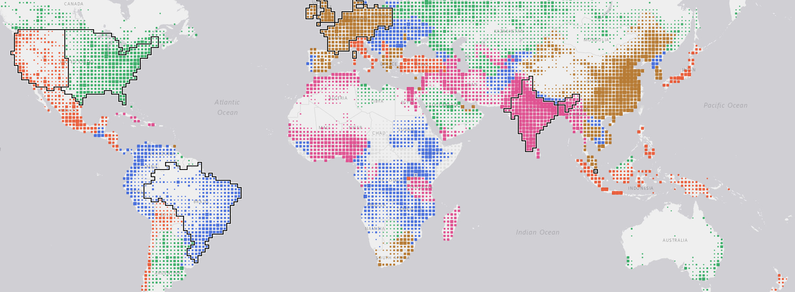

### Overarching repo for the Google Catalyst Project

The present repo and the `pypsa-earth` softfork should contain all project content.

## Layout

| Directory | Content |
|---|---|
| `config-pypsa-earth/` | How to run the PyPSA-Earth soft fork (`pypsalabs/catalyst-pypsa-earth`, cloned to the gitignored `models/pypsa-earth`) |
| `misc-quarterN/` | Self-contained code/data for complementary experiments and visualisations |
| `beamer/<date>/` | |
| `meetings/` | Meeting notes, `YYYY-MM-DD.md`. |

## `misc-quarter1/` at a glance

**`country-classification/`** — every country or sub-national grid scored on the SOW archetype dimensions and assigned to one of five archetypes; the outlined regions are the modelled representatives. Interactive version: `land-grid-map/` (Vercel).

**`technology-costs/`** — 2025 capex/opex/LCOE baseline for the mature and advanced technology palette, normalised to USD2024 and compared with observed project costs.

