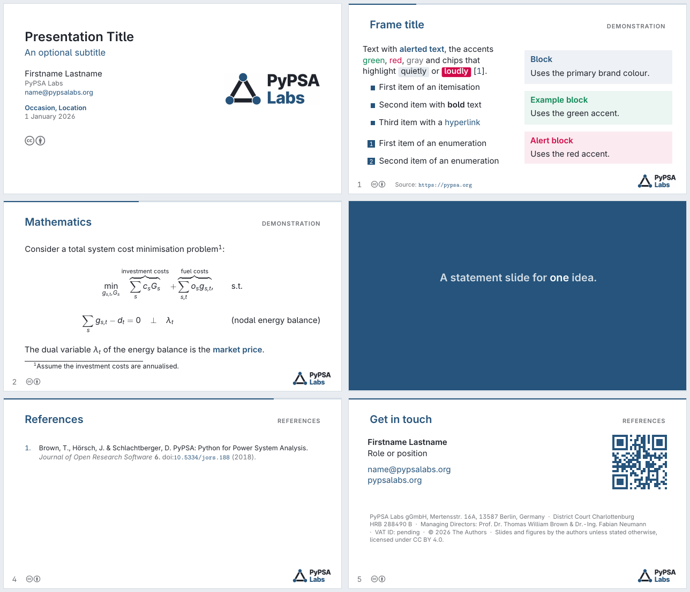

# PyPSA Labs beamer template



## Dependencies

TeX Live or MiKTeX with `beamer`, `inter`, `microtype`, `parskip`, `textpos`,
`pgf`, `booktabs`, `eurosym`, `qrcode`, `doclicense`, `biblatex` and `biber`.

## Compile

```sh
latexmk -pdf template.tex
```

Refresh the preview above with:

```sh
pdftoppm -png -r 100 template.pdf /tmp/prev
montage /tmp/prev-*.png -tile 2x3 -geometry +6+6 \
  -background '#e9edf1' -bordercolor '#d5dbe2' -border 1 preview.png
```