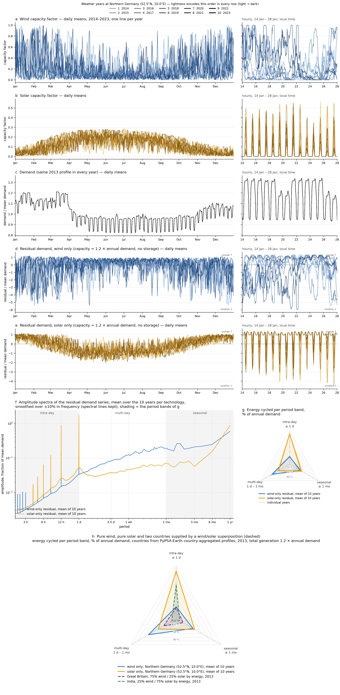
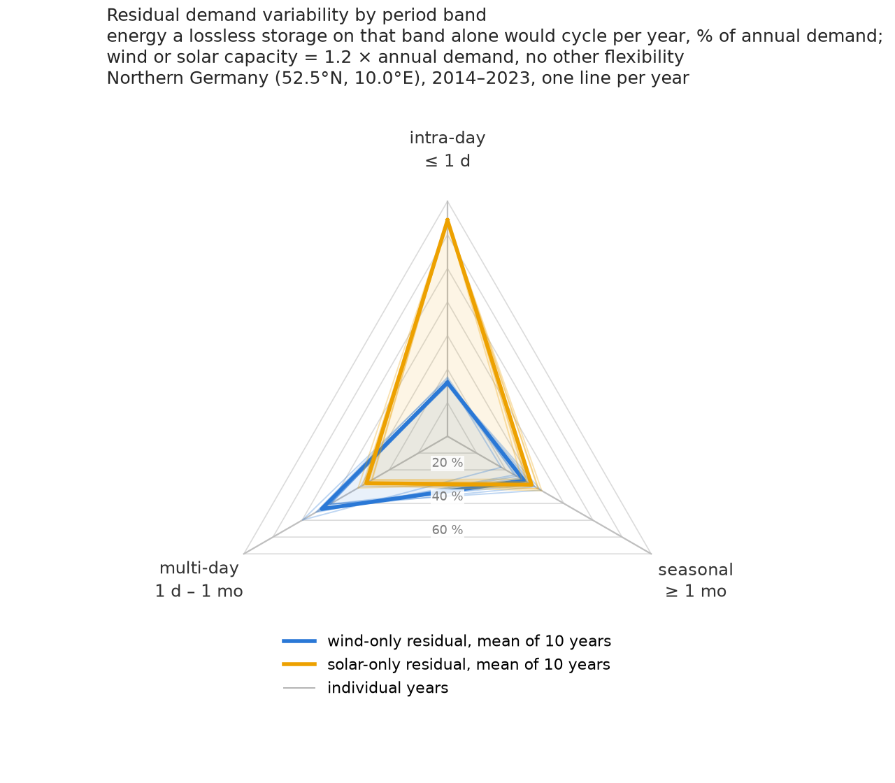
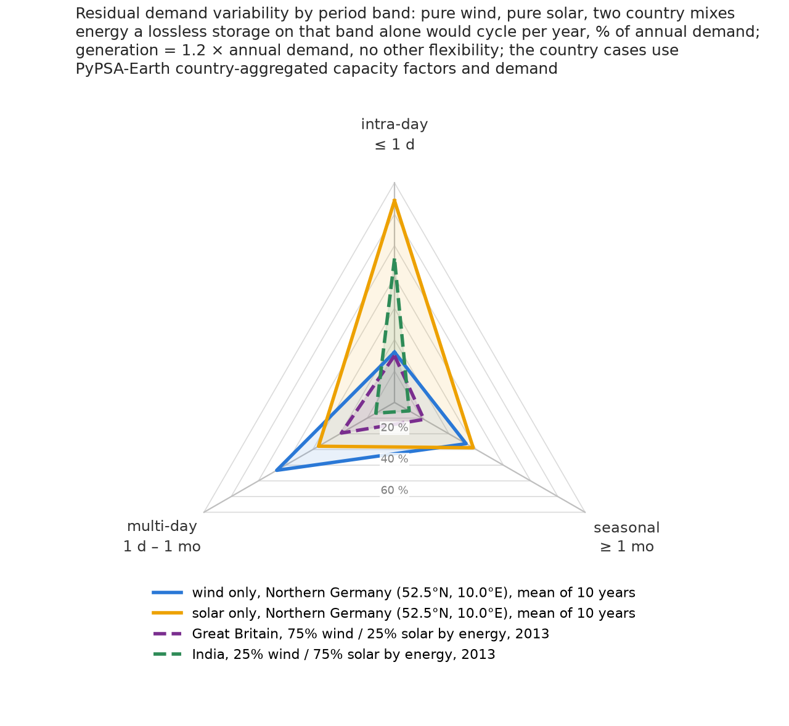

# Temporal structure of the residual demand: wind vs solar (exploratory, WP3 preparation)

When a region leans on wind or on solar, *when* is demand left unmet and on which
time scales? Wind alone or solar alone is scaled to 1.2 × annual demand without storage and
the residual demand is shown in the time domain and as amplitude spectra, for ten
independent samples of a year of weather. Two variants of the same six-row figure:

* **years** (headline): one site, Northern Germany (52.5°N, 10.0°E), ten ERA5 weather
  years 2014–2023 from the [Open-Meteo archive](https://open-meteo.com/en/docs/historical-weather-api),
  converted to capacity factors here, with the demand profile of the nearest bus of the
  project's [PyPSA-Earth stage network](../../config-pypsa-earth/README.md) (2013) in every year.
* **sites**: ten mutually uncorrelated buses of the PyPSA-Earth stage networks (US,
  North-West Europe, Brazil, India), each with its own 2013 weather and demand.

It is a first look at the temporal structure that firm capacity and storage would have to
cover, ahead of the WP3 investment loop.



*Rows a–e: left the full year as daily means, right a two-week hourly window in local
time; lightness encodes the order of the legend. Row f: one-sided amplitude spectra of the
residual series, averaged over the ten series per technology, with the three period bands
shaded; g: the same information binned into those bands as a radar chart (also on its own as
`figures/residual_bands_years.png`, numbers in `build/bands_years.csv`); h: the pure triangles
next to the two country mixes of `figures/residual_bands_mix.png`. The sites variant is
`figures/residual_structure_sites.png` / `figures/residual_bands_sites.png`, its independence
check `figures/site_correlation.png`.*

 

*Left: the ten weather years at the German site. Right: the two mean triangles next to two
countries supplied by a superposition, Great Britain at 75 % wind / 25 % solar and India at
25 % / 75 % by energy, from country-aggregated PyPSA-Earth profiles (2013,
`figures/residual_bands_mix.png`, numbers in `build/bands_mix.csv`).*

```
Open-Meteo archive API (ERA5, hourly, point)
  └─ retrieve_weather.py ─►  data/openmeteo/<site>_<year>.csv    ws100, GHI, DNI, DHI, T2m (UTC, cached)
       └─ build_years.py ─►  build/profiles_years.nc        time × series(year): cf_wind, cf_solar, demand_mw
        + NWE/elec_s_50.nc   build/years.csv                per year: mean CFs, load, worst cross-year anomaly |ρ|
                             build/years_correlation.csv    cross-year anomaly correlation matrices
../../models/pypsa-earth/networks/{US,NWE,BR,IN}/elec_s_50.nc     clustered stage networks (unsolved, 2013)
  └─ extract_profiles.py ─►  build/profiles_sites.nc        time × series(site): cf_wind, cf_solar, demand_mw
                             build/sites.csv                region, bus, lon/lat, name, load, mean CFs, UTC offset
                             build/site_correlation.csv     anomaly correlation matrices (wind, solar, hourly wind)
       └─ plot_site_correlation.py ─►  figures/site_correlation.{png,pdf}         map + correlation heatmaps
  └─ plot_residual_structure.py ─►  figures/residual_structure_{years,sites}.{png,pdf}   the six-row figure (years: + row h from build/bands_mix.csv)
                                    figures/residual_bands_{years,sites}.{png,pdf}       the band radar alone
                                    build/bands_{years,sites}.csv                        per series, technology, band
  └─ plot_mix_radar.py ─►  figures/residual_bands_mix.{png,pdf}   pure triangles + GB and IN mixes; build/bands_mix.csv
     (build/profiles_years.nc + NWE and IN networks, country-aggregated)
```

Run from this directory with the priam-myopic pixi env (pypsa 1.2.4 reads the v0.30.3
networks with a version warning):

```bash
S=../../models/priam-myopic/.pixi/envs/default/bin/snakemake
$S -n        # dry run
$S -c1       # build everything (~1 min)
```

Every script also runs standalone (`python build_years.py`, `python plot_residual_structure.py years`)
and reads `config.yaml` next to it. Weather downloads are cached; delete `data/openmeteo/` to refetch.

## Method

**Weather years (years variant).** Hourly ERA5 at the point (Open-Meteo, `models=era5`):
100 m wind speed, GHI, DNI, DHI (means of the preceding hour) and 2 m temperature.
Wind: the speed through a 3 MW-class power curve (`years.wind_turbine`, cut-in 3 m/s,
rated 13 m/s, cut-out 25 m/s), one turbine, no fleet smoothing. Solar: fixed 35° tilt,
equator-facing, plane-of-array irradiance from DNI·cos(AOI) + isotropic diffuse + ground
reflection (albedo 0.2) with a compact NOAA-style solar position evaluated at the middle
of each hour, cell temperature via NOCT 45 °C, −0.35 %/K, 90 % system efficiency.
Leap days are dropped so every year has 8760 h. Demand is the 2013 profile of the nearest
PyPSA-Earth bus (DE0 4, 43 TWh/a) in every year: the variability shown is weather
variability only. Weather years are independent samples by construction; for the record
the cross-year anomaly correlation (same definition as below) is written to
`build/years_correlation.csv` (worst pair 0.29, consistent with noise for ~80 effective
synoptic samples).

**Sites (sites variant).** The candidate pool is every clustered bus of the four networks that has an
`onwind` and a `solar` generator and a load, screened for a usable resource (mean wind CF
≥ 0.15, mean solar CF ≥ 0.10) and size (≥ 2 TWh/a). Ten sites are then picked greedily so
that they are *mutually uncorrelated*: starting from the largest load, each step adds the
candidate whose worst |ρ| against the already selected sites is smallest, with at most
four sites per region, and the run aborts if the worst pair exceeds `selection.max_abs_corr`
(0.25). Correlation is measured on the **anomaly band** (daily mean CF minus a centred
31-day rolling mean), for wind and solar separately, so the shared diurnal and seasonal
cycles, which the spectrum is meant to show, do not count as correlation. The
selection is data-driven; the result and its worst pair are printed and drawn in
`figures/site_correlation.png`. With a single weather year this is what "independent
samples" can mean: sites far enough apart that their weather is unrelated (synoptic wind
correlation decays to ≈0 beyond ~1500 km).

**Local time.** All sources are in UTC; each series is shifted by round(lon/15) hours
(circularly over the year) so the diurnal peaks line up in the hourly panels. Spectra are
shift-invariant.

**Residual.** With capacity factor `cf` and demand `d`, the capacity is `P = f·Σd/Σcf`
with the overbuild `f = 1.2`, and the residual `r = d − P·cf`, plotted relative to mean
demand. Positive is unmet demand, negative surplus. No storage, no transmission, no other
generators: the residual is the raw shape that firm capacity, storage or curtailment
would have to absorb.

**Spectra.** `2·|rfft(r − mean r)| / N` per site over the 8760 hourly values, against the
period on a log axis; the thick lines are the arithmetic mean of the ten amplitude
spectra per technology, smoothed with a mean over ±10 % in frequency; bins that exceed
2.5 × the median of that band are spectral lines (the diurnal harmonics of solar) and are
kept unsmoothed and excluded from their neighbours' mean. The DC bin is dropped.

**Period bands (radar).** The mean-removed residual is split into three band-passed series
by zeroing all Fourier bins outside the band and transforming back: intra-day (period
≤ 24 h, the diurnal line included), multi-day (1 d – 1 month) and seasonal (≥ 730 h, the
monthly bin included; `bands` in `config.yaml`). The three add up to the residual; the DC
part, the 20 % surplus from overbuilding, is left out. Each vertex is the energy a lossless
storage acting on that band alone would cycle per year, i.e. the sum of the positive part of
the band-passed series, as % of annual demand. Because the band series have zero mean the
charged and discharged energy are equal, so the number is the storage throughput that band
requires, without saying anything about its power or duration (the band's period range does
that). `build/bands_<variant>.csv` also lists the band RMS as % of mean demand, which adds
up in quadrature to the residual's standard deviation (Parseval). Thin triangles are the
individual series, thick ones the mean per technology. In the mix figure a country is
supplied by both: `P_w = s·f·Σd/Σcf_w`, `P_s = (1−s)·f·Σd/Σcf_s` with the wind energy share
`s` from `mixes.<CC>.wind_share`, capacity factors are the potential-weighted mean over the
country's buses (`p_nom_max` weights) and demand the sum over its loads; the pure triangles
are the German site's ten-year means, not the country's own, so the comparison is between
technologies and mixes, not between places.

**Colours.** Blue = wind, yellow = solar, grey = demand (pair validated with the
dataviz palette checker); within a row the series order is encoded as lightness because
ten categorical hues cannot be told apart reliably.

## Caveats

- Years variant: ERA5 point wind at 100 m is biased low over land (mean 5.7–6.3 m/s here,
  annual wind CF 0.17–0.23 against ~0.25–0.30 for a modern onshore fleet in northern
  Germany) and an unsmoothed single-turbine curve is spikier than a fleet; the PV model is
  simple (no spectral, soiling or inverter-clipping effects). Neither changes the location
  of the spectral features, only their weight.
- Mix figure: the country-aggregated PyPSA-Earth capacity factors are low (GB solar 0.09,
  India wind 0.11, potential-weighted over all buses incl. poor sites), so the implied
  capacities are large; the shape of the triangles is what matters. Shares are illustrative.
- Sites variant: one weather year (2013) and the PyPSA-Earth bus-aggregated,
  potential-weighted capacity factors, which are smoother than a single plant.
- Demand is the synthetic GEGIS SSP2-2.6 2030 profile that PyPSA-Earth distributes over
  buses by GDP and population: buses of one country share a demand shape, the weekly
  pattern is stylised, and the German profile has visible step changes in April and
  November. It is reused unchanged for every weather year.
- The Natural Earth admin-1 file cached by the archetype pipeline has no rows for France;
  those sites fall back to the country name with an N/S suffix.
- The `models/octants/` single-cell 2011 profiles would give truly global spread but
  carry no demand and two onwind octants are corrupt; they were not used.
