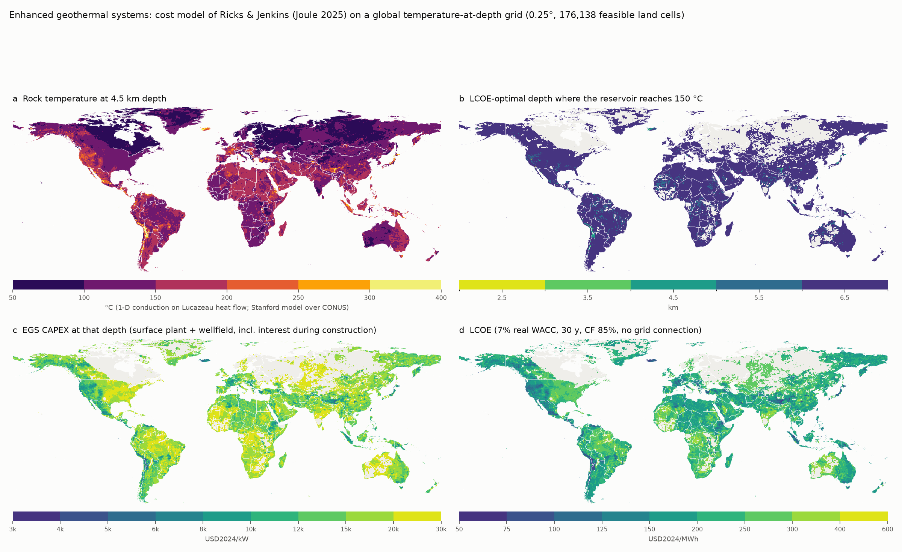
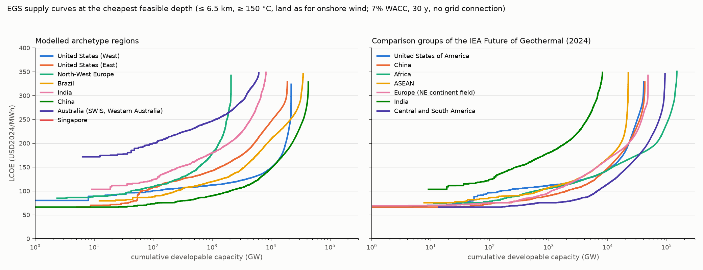
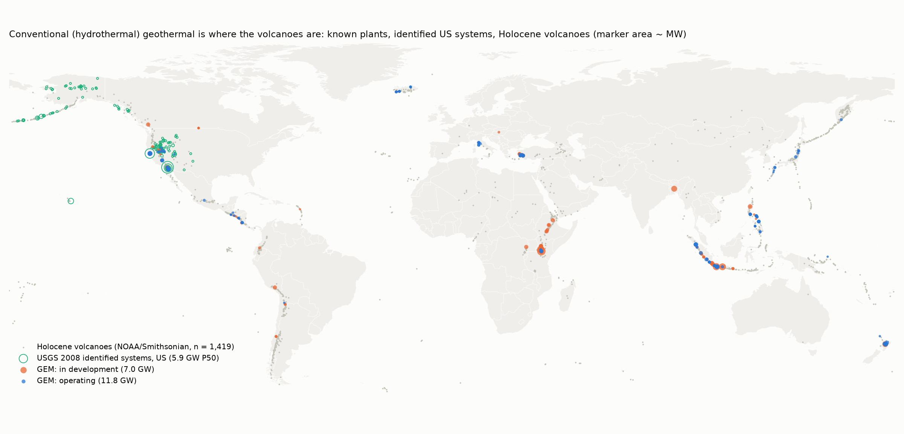

# Global geothermal potential with CAPEX, OPEX and lifetime: EGS and hydrothermal

Two datasets for the archetype models, in USD2024:

* **EGS** (enhanced geothermal, stimulated reservoirs, available almost anywhere at
  depth): for every 0.25° land cell the reservoir temperature at 2.5–6.5 km, the
  LCOE-optimal drilling depth, CAPEX (surface plant + wellfield), fixed O&M, lifetime and
  developable capacity; country and archetype-region supply curves derived from it.
* **Hydrothermal** (conventional geothermal, naturally permeable hot reservoirs, no
  stimulation, spatially confined to volcanic arcs and rifts): a global site list
  (known plants and identified US systems), a country table of installed capacity,
  pipeline and potential, a prospectivity screen on the same 0.25° grid, and the
  NREL ATB / IRENA cost classes. See "Hydrothermal" below.

A hydropower cost-statistics companion (IRENA, technology-data, ANU pumped-hydro atlas
and cost model, GloHydroRes fleet) is kept at the end. Everything in "Sources scoped"
documents what exists and why it was or was not used.

Run from this directory with the priam-myopic pixi env (~1 min after the downloads):

```bash
../../models/priam-myopic/.pixi/envs/default/bin/snakemake -c1
```



*a: rock temperature at 4.5 km; b: cheapest feasible depth; c: CAPEX and d: LCOE at that
depth. Grey land: no depth ≤ 6.5 km reaches 150 °C. Perceptually uniform colormaps
(inferno, viridis) with explicit class edges.*



## Method

1. **Temperature at depth** (`build_temperature_grid.py`). Steady-state 1-D conduction,
   T(z) = T_s + q₀ z / k − A z² / 2k, with the Lucazeau (2019) 0.5° heat-flow map and
   WorldClim 2.1 surface temperature, exactly as in
   [`../country-classification/geothermal_egs.py`](../country-classification/geothermal_egs.py)
   but on a 0.25° grid and for the five depths the cost model is fitted for. Two changes
   versus the archetype pipeline, both driven by `validate_conus.py`:
   * k = 2.25 W/m/K instead of 2.5. Against the Stanford thermal model over CONUS (the
     temperature-at-depth data shipped with Ricks & Jenkins, 81,697 candidate areas), 2.5
     W/m/K gives a cold bias of −13 °C at 2.5 km growing to −29 °C at 6.5 km; 2.25 is the
     one-parameter least-squares fit and leaves −6 to −12 °C (`build/validation_conus.csv`).
     A two-parameter fit (k and A free) turns A negative, i.e. the reference has gradients
     that *increase* with depth, which pure conduction with constant k cannot reproduce.
   * Over CONUS the Stanford values replace the conduction estimate (`t_source =
     stanford_conus`, 13,309 cells; `thermal.conus_override` in `config.yaml`). The Lucazeau
     map is an interpolation of sparse measurements and smooth: r ≈ 0.63–0.65 against the
     Stanford model at every depth, RMSE 19 °C at 2.5 km to 49 °C at 6.5 km
     (`figures/validation_conus.png`). Outside the US that smoothness remains; narrow
     volcanic provinces (Taupo, the Kenyan rift, Larderello) are under-resolved, and Europe
     has better models (see sources) that could be swapped in the same way.
2. **Cost model** (`egs_cost_model.py`). A vectorised port of `EGS_Costs.py` from the
   supplementary data of Ricks & Jenkins, *Pathways to national-scale adoption of enhanced
   geothermal power through experience-driven cost reductions*, Joule 2025
   ([Zenodo 10.5281/zenodo.15485307](https://doi.org/10.5281/zenodo.15485307), CC-BY-4.0).
   It is GETEM-derived in 2021 USD: per-depth fits of surface-plant cost and gross output per
   injector as functions of production temperature (binary/ORC plants, linear extrapolation
   above 200 °C), quadratic well cost in depth (cased/uncased, 7,500 ft laterals), stimulation,
   exploration and test drilling, interest during construction, drilling success 90 %, GETEM
   O&M and labour with the ATB-2023 O&M derating, and a wellbore temperature loss and ambient-
   temperature correction. The port reproduces the source function to 1e-15
   (`build/cost_model_regression.txt`). Parameters are the paper's central deep-EGS case
   (1.5 producers per injector, stimulated producers, 77 % flow derating, 20 % of land
   developable); the cost model's own project/interconnection annuities are not used.
   Reference values of the model at 283 K ambient, USD2021/kW:

   | reservoir T | 2.5 km | 3.5 km | 4.5 km | 5.5 km | 6.5 km |
   |---|---|---|---|---|---|
   | 150 °C | 8,960 | 10,490 | 12,450 | 14,730 | 17,300 |
   | 200 °C | 5,690 | 6,700 | 8,000 | 9,600 | 11,470 |
   | 250 °C | 4,110 | 4,770 | 5,640 | 6,700 | 7,950 |
   | 300 °C | 3,420 | 3,920 | 4,580 | 5,380 | 6,320 |

   For comparison, NREL ATB 2024 representative plants (2022 USD, OCC): Deep EGS binary
   175 °C / 3 km 13,510, Deep EGS flash 7,630, NF-EGS binary 9,140, hydrothermal flash
   225 °C / 2.5 km 4,760; the Ricks & Jenkins model sits below the ATB because it bakes in
   the 2022–2024 drilling performance of Utah FORGE and Fervo (the same evidence that led NREL
   to cut its drilling cost curves by ~25 % in 2025, Akindipe & Witter, SGW 2025).
3. **Potential** (`build_egs_potential.py`). For every cell and depth: feasibility (reservoir
   ≥ 150 °C, the binary-cycle floor of Aghahosseini & Breyer 2020; temperatures above 350 °C are
   capped for costing), CAPEX and FOM inflated 2021 → 2024 USD with the CPI table of
   `../technology-costs/config.yaml` (×1.158), LCOE at 7 % real WACC, 30 y (NREL ATB lifetime)
   and 85 % capacity factor (90 % until 2026-10-05), no grid connection; costs and capacity per **net** kW: the
   cost model's output excludes wellfield pumping, so per-kW costs are divided by (1 − `parasitic_fraction`)
   = 0.85 and MW multiplied by it; capacity = cell area × the model's capacity density (output per injector
   unit / 1.39 km² per unit) × the cell's **available land share** (`build/land_availability.nc`, rule
   `land_availability`: the onshore-wind exclusions of the PyPSA-Earth fork, read from its config.default.yaml —
   Copernicus LC100 2019 land-cover classes allowed for wind, 1 km from urban land, outside the fork's WDPA
   natura.tiff; area-weighted 70 % of feasible cell area; it replaced Ricks & Jenkins' flat 20 % on
   2026-10-05, which removed e.g. the hot protected cells of Yellowstone from the cheapest US West tranche). The
   headline table keeps each cell's cheapest feasible depth; the netCDF keeps all depths.
4. **Aggregation** (`aggregate_regions.py`): supply curves in LCOE bins and a summary per ISO3
   and per composite region (US West/East and Australia SWIS by Natural Earth admin-1, as in
   the archetype pipeline; North-West Europe as in `config-pypsa-earth/config.NWE.yaml`;
   ASEAN, Europe, Africa, Central+South America for the IEA comparison).

## Outputs

| file | content |
|---|---|
| `build/egs_potential.csv` | **the dataset**: one row per feasible 0.25° land cell (176k rows, Antarctica excluded): lon, lat, iso3, country, continent, admin1, `t_source`, area, heat flow, `depth_km`, `t_reservoir_c`, `capex_usd_per_kw` (+ plant / well split), `fom_usd_per_kw_yr`, `vom_usd_per_mwh` (0), `lifetime_years` (30), `capacity_factor`, `lcoe_usd_per_mwh`, `mw_per_km2`, `capacity_mw` |
| `build/egs_grid.nc` | the same for every cell × depth (also infeasible cells), plus the temperature grid |
| `build/egs_supply_curves.csv` | region × LCOE bin: capacity in the bin, cumulative capacity, capacity-weighted CAPEX, FOM, depth, temperature |
| `build/egs_region_summary.csv` | one row per country / region: potential below 75–300 USD/MWh, minimum LCOE and CAPEX, cost/depth/temperature of the cheapest 10 GW |
| `build/temperature_grid.nc`, `build/validation_conus.csv` | temperature grid and its CONUS check |
| `build/hydro_costs.csv` | long table of hydropower and pumped-hydro costs, lifetimes, capacity factors (see below) |
| `build/phes_potential_by_region.csv` | ANU greenfield PHES atlas: site counts and GWh by UN region, storage configuration (2 GWh/6 h … 150 GWh/18 h) and cost class A–E |
| `build/hydro_existing_by_country.csv` | GloHydroRes: existing capacity per country by plant type (storage, run-of-river, pumped, canal) |
| `figures/egs_doc_gradient.pdf`, `figures/egs_doc_capex.pdf` | two half-width maps for the technology-assumptions document (`plot_doc_maps.py`, rule `doc_maps`): mean geothermal gradient from the surface to 4.5 km, (T(4.5 km) − T_surface)/4.5 km in °C/km (colour capped at 60, the conduction model's hotspot outliers run above it), and `capex_usd_per_kw` at each cell's LCOE-optimal depth (viridis, log scale 7,000–26,000 = the 1–99 % range of the cells, per net kW), land without a feasible reservoir in grey, the `site_checks` sites circled; no country borders |
| `build/site_check.csv` | the cost model at real EGS sites (`site_check.py`, rule `site_check`, sites under `site_checks` in config.yaml: Fervo Cape Station): the 0.25° cell containing the site, its LCOE-optimal depth, temperature, CAPEX, LCOE, and per fitted depth the drilling cost of one cased well with the configured 2,286 m lateral (`egs_cost_model.well_costs`, stimulation excluded), its length and cost per foot in USD2024. At Cape Station: 435 USD/ft for a Cape-length well (2.5 km + lateral, 15,700 ft; Fervo's Cape wells 633 → ~360 USD/ft), 738 USD/ft at the cell's own depth of 5.5 km, where the model goes because the Stanford map gives only 166 °C at 2.5 km; drawn on `../technology-costs/figures/learning/egs.pdf` |

Cheapest 10 GW per modelled region (USD2024 per net kW, land as for onshore wind, capacity factor 0.85; `build/egs_region_summary.csv`, 2026-10-05):

| region | potential GW (≤ 300 USD/MWh) | GW ≤ 100 USD/MWh | min LCOE | CAPEX of first 10 GW | FOM | depth | T |
|---|---|---|---|---|---|---|---|
| US West | 21,785 | 91 | 66 | 6,438 | 142 | 4.5 km | 283 °C |
| US East | 18,227 | 61 | 66 | 4,803 | 118 | 3.5 km | 330 °C |
| North-West Europe | 2,074 | 42 | 85 | 6,265 | 140 | 5.2 km | 334 °C |
| Brazil | 32,104 | 237 | 79 | 5,701 | 132 | 4.5 km | 343 °C |
| India | 6,719 | 0 | 104 | 7,588 | 160 | 6.5 km | 330 °C |
| China | 41,905 | 1,968 | 66 | 4,682 | 116 | 3.5 km | 381 °C |
| Australia SWIS (WA) | 3,742 | 0 | 172 | 12,908 | 238 | 6.5 km | 240 °C |
| Singapore | 0 | 0 | 154 | 11,512 | 218 | 6.5 km | 259 °C |

For the investment loop the useful quantities are the cost of the first tranches and the
shape of the curve; the totals are far less robust (next section).

## Caveats

* **Potential totals scale with land and spacing.** The numbers in this bullet are from the earlier flat 20 %
  land share; since 2026-10-05 the share comes from the onshore-wind exclusions (~70 % of feasible cell area,
  550 TW net at ≤ 6.5 km). 20 % developable land (Ricks & Jenkins;
  Franzmann et al. 2025 find 25 % globally, 5–72 % by country) and the model's well spacing
  give ~8.5 MW/km² of hot land at 100 %. Against the IEA/Project InnerSpace numbers (technical
  potential below 300 USD/MWh): at ≤ 4.5 km this dataset gives 59 TW at 20 % land (293 TW at
  100 %) versus the IEA's 42 TW at ≤ 5 km; at ≤ 6.5 km 186 TW (929 TW at 100 %) versus the
  IEA's 600 TW at ≤ 8 km. Per region at 20 % land, ≤ 6.5 km: US 16.5 TW (IEA > 70 at ≤ 8 km,
  7 at ≤ 5 km), China 14.6 (IEA 50), Africa 44 (115), Europe 20 (40), ASEAN 9 (125), India 4.1
  (IEA 14 at ≤ 5 km). Same order of magnitude; the IEA counts depth to 8 km and does not derate
  land, this dataset stops at 6.5 km and derates. Treat the totals as "effectively unbounded
  for an investment model" and the per-kW costs as the information content.
* **The heat-flow map is smooth.** r ≈ 0.65 against the Stanford CONUS model; the same is to
  be expected elsewhere. Known hydrothermal provinces on modest map heat flow (New Zealand,
  Kenya, Italy) are under-rated; the US is the only region with a resolved model here.
* **Cost model calibrated to the US.** Drilling and plant costs are US 2021–2024 industry
  data; no regional cost multipliers are applied (IRENA's hydro tables below show what
  regional spreads look like for a mature civil-works-heavy technology). Learning is
  *not* included: this is the 2025 baseline, learning is endogenous in the study (SOW §1.2).
* **Plant type.** All plants are binary/ORC-type fits; above 200 °C the model extrapolates
  linearly and is capped at 350 °C. Flash plants for high-enthalpy resources would be cheaper
  per kW than the extrapolation at 250–350 °C. Gross output excludes wellfield pumping load.
* **Capacity factor** 0.9 is availability (ATB: 0.9 flash, 0.8 binary); thermal drawdown over
  the 30-year life is inside the source model's productivity assumptions, not modelled
  explicitly. No make-up drilling.
* Grid connection, water availability, protected areas and seismic-risk exclusions are not
  applied (Franzmann et al. 2025 do a land-eligibility analysis; the archetype pipeline's
  screening is by temperature only).

## Hydrothermal (`build_hydrothermal.py`)



Conventional geothermal needs a naturally permeable, hot reservoir; the fields cluster
along volcanic arcs and rifts (Stefansson 2005 showed that the number of Holocene
volcanoes in a region predicts its identified hydrothermal potential). No open global
site-level *resource* assessment with costs exists, so the module combines:

| file | content |
|---|---|
| `build/hydrothermal_sites.csv` | 422 sites: Global Energy Monitor geothermal tracker units (Jan 2023 snapshot, 205 operating = 11.8 GW, 91 in development = 7.0 GW, plant type, coordinates) plus the 125 USGS-2008 identified US systems (reservoir temperature, P5/P50/P95 MW potential; 5.9 GW P50). Each site carries a cost class (flash ≥ 200 °C or flash/dry-steam plant, binary otherwise, unknown for 123 GEM units without a type) with ATB CAPEX, FOM, CF and a 30-y lifetime |
| `build/hydrothermal_country.csv` | 96 countries: installed MW (IRENA via Our World in Data, latest year), GEM operating and pipeline MW, Holocene volcano count, published identified potential (Stefansson 2005 Table 1 for 8 countries; USGS 2008 national mean 9,057 MW for the US), a volcano-scaled screening estimate (158 MWe per accessible volcano, the Stefansson calibration that gives 209 GWe worldwide), `potential_best_mw` (published where it exists, else volcano-scaled, never below installed + pipeline), `potential_upper_mw` (× 5 for hidden resources, the low end of Stefansson's 5–10×), `remaining_potential_mw`, and the flash/binary cost columns |
| `build/hydrothermal_cells.csv` | every 0.25° land cell: distance to the nearest Holocene volcano and to the nearest operating plant / identified system; `hydrothermal_prospective` (≤ 50 km of a volcano or ≤ 25 km of a known site: 6,549 cells, 4.0 M km², 2.7 % of land); `nearfield_egs_candidate` with the EGS cost of that cell (ATB's cheaper "near-field EGS" class applies at the margins of hydrothermal fields) |
| `build/hydrothermal_costs.csv` | NREL ATB 2024 hydrothermal flash / binary and the four EGS classes (Advanced / Moderate / Conservative, 2022–2040), OCC in 2022 USD converted to USD2024 (× 1.072); IRENA 2024 observed costs |
| `data/hydrothermal_regional_potential.csv` | the transcribed published numbers: Stefansson 2005 Tables 1–2, Bertani 2003 GEA-region resources (world 280 GW), USGS 2008, IRENA 2024 |

Costs for the 2025 baseline (ATB 2024 Moderate 2025, USD2024): hydrothermal flash
4,890 USD/kW, FOM 128 USD/kW-yr, CF 0.90; hydrothermal binary 6,420 USD/kW, FOM 166,
CF 0.80; near-field EGS flash / binary 6,550 / 8,850. IRENA's observed 2024 global
weighted average is 4,015 USD/kW (project range 1,217–6,724 over 2010–2024), FOM 125
USD/kW-yr, CF 88 %, LCOE 60 USD/MWh (33–90). Lifetime 30 y (ATB).

World totals: installed 15.6 GW; best-estimate potential 211 GW (Stefansson 209 GWe;
Bertani 70–140 GW with today's technology, 280 GW resources); upper bound ~1 TW.
Modelled regions: US 9.1 GW identified (2.7 installed, USGS undiscovered mean +30 GW),
China 2.1 GW, Australia 0.5 GW, North-West Europe < 1 GW (Germany 0.16, France 0.8,
Italy is outside NWE), Brazil / India / Singapore none. Caveats: the volcano-scaled
estimate misses non-volcanic hydrothermal provinces (Turkey's grabens, Tuscany,
Pannonian basin, sedimentary binary plants in Germany/Bavaria) and over-rates remote
arcs (Kamchatka, Aleutians, Andes); for the US the modelling route is the USGS site
list itself. The GEM snapshot is January 2023 (newer releases need the GEM form).

## Hydropower companion (`build_hydro.py`)

`build/hydro_costs.csv` is a long table (technology, region, period, size class, metric, value,
unit, currency year, source). It contains:

* **Conventional hydro, IRENA *Renewable Power Generation Costs in 2024* (Jul 2025), 2024
  USD** (transcribed in `data/irena_hydro_costs_2024.csv`): global weighted-average installed
  cost 2,267 USD/kW and LCOE 57 USD/MWh for 2024; installed cost by size class 0–1,000 MW
  (Table 6.2; 1,300–3,800 USD/kW, no clear economies of scale below 450 MW); by region for
  large and small plants and two periods (Table 6.3: Brazil 1,405, Other Asia 1,914, India
  1,991, China 2,216, Europe 2,282, Africa 2,515 USD/kW for large plants 2018–2024; North
  America 11,658 from a few overrun projects); capacity factors by region (Table 6.4, 38–64 %
  weighted averages); O&M 2–2.5 % of CAPEX per year (IEA/IPCC as cited).
* **Lifetimes and the repo's own baseline**: technology-data v0.15.0 via
  `../technology-costs`: hydro (reservoir) 80 y, 1 % FOM, 3,180 USD/kW; run-of-river 80 y, 2 %,
  4,770 USD/kW; PHS 60 y, 1,934 USD/kW + 79 USD/kWh (Viswanathan 2022).
* **Off-river pumped hydro, ANU RE100 group** (Blakers, Stocks et al.; Joule 2021 for the
  greenfield atlas). The simplified cost model (`data/anu_phes_simplified_calculator_2406.xlsx`,
  2024 USD; reservoirs 207 USD/m³ of dam rock, tunnel and powerhouse as functions of power,
  head and separation) evaluated at the atlas' standard configurations for a 600 m head /
  6 km separation site: e.g. 150 GWh / 18 h: 1,030 USD/kW total (57 USD/kWh); 50 GWh / 18 h:
  1,150 USD/kW; 15 GWh / 6 h: 960 USD/kW (161 USD/kWh); 500 GWh / 168 h: 22 USD/kWh. FOM ≈ 10
  USD/kW-yr, VOM 0.37 USD/MWh per direction. Site classes are cost relative to the class A/B
  benchmark (AAA < 0.33 … E < 2.0×); the benchmark itself is inferred from the sheet's default
  example (≈ 6,460 USD/kW for 1,000 MW / 100 GWh, i.e. ≈ 65 USD/kWh). The atlas' regional site
  counts and GWh per class come from the global summary spreadsheet
  (`data/anu_phes_global_summary.xlsx`, 22,000 TWh in 534k reservoir pairs; per-site KML/CSV
  are "available on request" from ANU).
* **Existing fleet**: GloHydroRes v1 (Sci. Data 2025, Zenodo 14526360, CC-BY): 7,778 plants,
  1,068 GW, with plant type, head, reservoir attributes.

Not in the dataset, because not openly available (see sources): a global site-level
*undeveloped* conventional-hydro potential with costs. PyPSA-Earth's hydro (existing plants
scaled by atlite runoff) is the modelling route for the archetypes; new reservoir hydro in the
2025–2040 window is small outside the Himalayas and Africa (Xu et al. 2023: 5.3 PWh/yr
profitable unused potential, two thirds Himalayan).

## Sources scoped

### EGS / geothermal potential with costs

| source | coverage, resolution | costs | access | used |
|---|---|---|---|---|
| **Ricks & Jenkins 2025**, Joule, supplementary data (Zenodo 15485307) | CONUS, 81,757 CPAs of ~88 km² with Stanford temperatures at 2.5–6.5 km | full GETEM-style cost model as Python code, 2021 USD; supply curves under learning | CC-BY-4.0 | **cost model applied globally; temperatures used over CONUS** |
| **Stanford thermal model** (Aljubran & Horne 2024) | CONUS | – | via the above | CONUS temperatures and validation |
| **Lucazeau 2019** heat flow (de Lavergne & Maisonnave 2024 regridding) | global 0.5° | – | CC-BY | temperature at depth outside CONUS |
| IHFC Global Heat Flow Database 2024 (GFZ, 91k points, quality codes) | global point data | – | open, xlsx/shp | not used; input for a better interpolation than Lucazeau if ever needed |
| **Aghahosseini & Breyer 2020**, Applied Energy | global 1°, 1–10 km, LCOE 2020–2050, optimal-depth potential per country | yes (their own drilling-cost curve, EUR) | data not published; the PyPSA-Eur `egs_costs.json` (which the user wrote the rule for) is the *European* subset received from the authors | not used; a request to the authors for the global grid would give the second opinion |
| **Franzmann, Heinrichs & Stolten 2025**, Renewable Energy 250:123199 (Jülich) | global, land-eligibility analysis, three reservoir models, LCOE | yes | no data repository found (RWTH record has the PDF only) | not used; reference for the 25 % eligibility figure |
| **IEA, The Future of Geothermal Energy** (Dec 2024) with Project InnerSpace | regional TW by depth bin (0.5–3, 3–5, 5–7, 7–8 km) below 300 USD/MWh | threshold only | report PDF, CC-BY; no data files | comparison numbers in "Caveats" |
| **Project InnerSpace GeoMap** | global, 150+ layers incl. temperature at depth and a techno-economic tool | LCOE tool | interactive only, personal non-commercial terms, no download/API | not used |
| TU Delft **Egberink, Limberger et al. 2026** (Zenodo 21416465, GitHub `Yegberink/module_geothermal`) | Europe, 10 km 3-D temperature (Limberger 2014), LCOE/potential/optimal depth for ORC, flash, Kalina | yes | CC-BY, Python snakemake module | not used; the natural upgrade for the NWE archetype's temperatures |
| NREL reV geothermal supply curves (GDR 1549) | CONUS / Great Basin | LCOE | CC-BY | superseded by Ricks & Jenkins |
| NREL ATB 2024 geothermal (six representative plants) | US | CAPEX/FOM/CF by resource class and scenario to 2050 | open CSV (OEDI) | reference values only (already in `../technology-costs/data/gap_fill.csv`) |
| Akindipe & Witter 2025 (SGW), Robins et al. 2022 (GRC): GETEM drilling cost curve updates; Fervo Cape Station well costs 350–630 USD/ft | US | drilling cost vs depth | PDFs | cited; curves are figures, not equations, so the Ricks & Jenkins quadratic fits are used instead |
| DOE Liftoff Next-Generation Geothermal 2024, GeoVision 2019 | US | FOAK/NOAK targets | PDFs in `lit/` | context |

### Hydrothermal (conventional)

| source | coverage | costs | access | used |
|---|---|---|---|---|
| **Global Energy Monitor, Global Geothermal Power Tracker** | 322 units ≥ 1 MW, all statuses, coordinates, plant type | – | CC-BY-4.0; Jan 2023 snapshot mirrored on GitHub (pz-max/gem-powerplant-data), current release via form | **sites, pipeline** |
| **USGS 2008 assessment** (Williams et al., FS 2008-3082) | 241 identified US systems (125 in the Ricks & Jenkins table), T, MW P5/P50/P95; undiscovered by region | – | via the Ricks & Jenkins archive | **US sites** |
| **Smithsonian GVP Holocene volcanoes** via the NOAA NCEI mirror (1,609 locations, 2006 snapshot) | global points | – | public domain (volcano.si.edu blocks scripts; current xls on GitHub jwilleke/volcano-lists) | **volcano counts, prospectivity screen** |
| **Stefansson 2005** (WGC): volcano-count method, Table 1 identified potentials, 209 GWe world | 8 countries + world | – | open PDF | **published potentials, calibration** |
| Bertani 2003/2009: GEA-region resources 2050 (280 GW) | 14 regions | – | open PDF | transcribed, not used in the table |
| **NREL ATB 2024** hydrothermal flash / binary, NF-EGS, deep EGS | US representative plants | CAPEX, FOM, CF, LCOE 2022–2050 | open CSV (OEDI) | **cost classes** (transcribed in `data/atb2024_geothermal.csv`) |
| **IRENA RPGC 2024** ch. 7 | global project statistics | installed cost, O&M, CF, LCOE | PDF | **observed costs** |
| Coro & Trumpy 2020 (J. Cleaner Prod.): global 50-km suitability map from 133 plants (MaxEnt) | global | – | figure only, no data | not used |
| IEA 2024 / Project InnerSpace: conventional potential is "almost 2,000 times" smaller than the 600 TW EGS figure (~300 GW) | world | – | report | consistency check |
| IRENA installed capacity (Our World in Data) | countries, annual | – | open | **installed MW** (already in `../country-classification/data`) |
| National assessments (Indonesia 23.9 GW, Kenya > 10 GW, Turkey ~4.5 GW, Ethiopia > 10 GW) | selected countries | – | reports | cited in notes; not systematically collected |

### Hydropower

| source | coverage | costs | access | used |
|---|---|---|---|---|
| **IRENA Renewable Power Generation Costs 2024** | global, by region/size | installed cost, LCOE, CF, O&M | PDF | **transcribed tables** |
| **ANU PHES atlases** (greenfield/bluefield/brownfield/ocean/seasonal) + cost model | global, 0.8 M sites | cost classes, simplified cost model | map server, summary xlsx, calculator xlsx; site data on request | **summary + cost model** |
| **GloHydroRes** (Sci. Data 2025) | 7,778 existing plants | – | CC-BY csv | **existing fleet** |
| technology-data v0.15.0 (via `../technology-costs`) | Europe-centric | CAPEX, FOM, lifetime | open | **lifetimes, baseline** |
| Gernaat et al. 2017, Nature Energy (PBL/IMAGE): 60k sites, 9.5 PWh/yr < 0.50 USD/kWh | global sites with cost | yes | paper paywalled, data by request to PBL | not used |
| Xu et al. 2023, Nature Water: 5.27 PWh/yr profitable with strict environmental constraints | global | cost model in MATLAB (`github.com/xurr2020/GlobalHydropower`), site results not published | code only | not used |
| Hoes et al. 2017, PLoS ONE (4TU 10.4121/uuid:99b42e30-…): gross potential at 15″/3″ | global, 3.6 GB | none | open | not used |
| Zhou et al. 2015, EES (PNNL/GCAM) basin-level cost curves | global basins | yes | not published | not used |
| Global Hydropower Tracker (GEM), WRI Global Power Plant Database | existing/planned plants | – | form / open | not needed beyond GloHydroRes |

## Data files (`data/`)

- `ricks2025_costing_and_supply_curves.zip` → `ricks2025/` — Ricks & Jenkins 2025
  supplementary data (Zenodo; downloaded by the `retrieve_ricks` rule with wget, Zenodo
  refuses curl). `EGS_Costs.py` is the cost model, the 25 MB CSV the CONUS temperatures.
- `irena_hydro_costs_2024.csv` — hand-transcribed from the IRENA report (Tables 6.2–6.4, S1,
  O&M text), each row with its table reference.
- `anu_phes_global_summary.xlsx`, `anu_phes_simplified_calculator_2406.xlsx` — Dropbox links
  on re100.eng.anu.edu.au (`pumped_hydro_atlas`, `pumped_hydro_cost_model`); read with the
  stdlib xlsx reader (no openpyxl in the env).
- `glohydrores_v1.csv` — Zenodo 14526360 (`retrieve_glohydrores` rule).
- `gem_geothermal_tracker_2023-01.csv` — GEM tracker snapshot (`retrieve_gem` rule, GitHub mirror).
- `noaa_volcano_locations.csv` — NOAA NCEI Hazel API, 9 pages of 200 (`retrieve_volcanoes` rule).
- `atb2024_geothermal.csv` — transcribed from the ATB 2024 v3 CSV (OEDI), R&D case, 30-y CRP.
- `hydrothermal_regional_potential.csv` — transcribed Stefansson / Bertani / USGS / IRENA numbers with sources.
- Heat flow, WorldClim and Natural Earth are read from `../country-classification/data/`.
