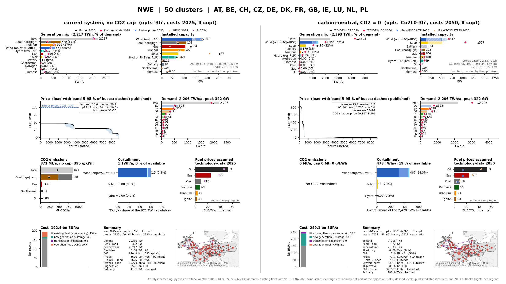

# PyPSA-Earth validation pages (WP1, September 2026)

Two generations of pages live here. **`figures/`** holds the current ones (2026-09-30 onwards): the
`now` solve is a dispatch of the **2024 system calibrated to Ember** (fleet, demand, hydro energy,
wind/solar capacity factors, 2024 fuel and CO2 prices per country, must-run / availability envelopes,
annual net-import and coal/gas energy bands; see the
[calibration section](../../config-pypsa-earth/README.md#calibration-to-2024-stages-r-now--g-now-re-run-as-a-dispatch-of-the-2024-system-2026-09-30)
of the fork notes). **`figures/out-of-the-box/`** keeps the pages of 2026-09-20/30 described in the
rest of this file: the six prenetworks solved *as PyPSA-Earth comes*, which is what motivated the
calibration (coal +11 pp, gas −12 pp, solar +10 pp of generation share on average over the world).

## Out of the box (2026-09-20/30, `figures/out-of-the-box/`)

How do the six catalyst prenetworks behave when solved *as PyPSA-Earth comes*, before any project
patch touches costs, technologies or constraints? One 16:9 page per region, produced inside the
[soft fork](../../config-pypsa-earth/README.md) by `config-pypsa-earth/validation.smk` and copied
here because the fork's `results/` directory is not tracked. The pages are the WP1 sanity check of
the data pipeline against published statistics (SOW §2, WP1: IEA/IRENA validation) and the
baseline the WP3 investment loop starts from.

Each page shows two screening solves side by side (weather 2013, 50 clusters except Singapore
with one node, 3-hourly, Gurobi barrier, details in the
[screening-solves section](../../config-pypsa-earth/README.md#screening-solves-stages-r-now-r-zero-dashboardr-2026-09-1920)):

* **left, `<R>-now`**: the current system, brownfield expansion, no CO2 cap, `costs_2025.csv`;
* **right, `<R>-zero`**: carbon-neutral the way PyPSA-Earth does it by default, `opts Co2L0`,
  `costs_2050.csv`, no new firm clean technology, no imports.

Ten tiles per block: generation mix, installed capacity (hatched = added by the optimiser),
load-weighted price duration curve with the band across buses, demand per country, CO2 by carrier,
curtailment, the fuel prices the model assumes, system cost split, a summary box and the network
map. Dots and dashed levels are published statistics on the left (Ember 2025, national statistics
2024, IRENA 2024, Energy Institute 2024, Ember prices 2023) and 2050 outlooks on the right
(TYNDP24, IEA WEO25 NZE / STEPS and regional equivalents); the sources are listed in
`config-pypsa-earth/data/validation/`.

Both solves inherit PyPSA-Earth defaults that shape the numbers and are worth keeping in mind when
reading the pages: GEGIS SSP2-2.6 **2030** demand rather than 2024/25, load shedding at
100 kEUR/MWh, `noisy_costs`, 6 h hydro reservoirs, the ≈2022 powerplantmatching fleet plus IRENA
2023 wind and solar as fixed minimum capacity.

China was a candidate dense-grid region and was screened before North-West Europe replaced it in
the archetype set; its page is kept for reference.

| Region | Page |
|---|---|
| United States (CONUS) | [figures/out-of-the-box/validation_US.png](figures/out-of-the-box/validation_US.png) |
| North-West Europe (AT, BE, CH, CZ, DE, DK, FR, GB, IE, LU, NL, PL) | [figures/out-of-the-box/validation_NWE.png](figures/out-of-the-box/validation_NWE.png) |
| Brazil | [figures/out-of-the-box/validation_BR.png](figures/out-of-the-box/validation_BR.png) |
| India | [figures/out-of-the-box/validation_IN.png](figures/out-of-the-box/validation_IN.png) |
| Singapore (one node) | [figures/out-of-the-box/validation_SG.png](figures/out-of-the-box/validation_SG.png) |
| China (reference only) | [figures/out-of-the-box/validation_CN.png](figures/out-of-the-box/validation_CN.png) |



## Regenerating

The pages are rendered in the fork (`models/pypsa-earth/results/catalyst/validation_<R>.png`) by
the `dashboard:<R>` stage of `config-pypsa-earth/run.sh`, which needs the two solved networks of the
region:

```bash
# from the repo root
bash config-pypsa-earth/run.sh <R>-now <R>-zero dashboard:<R>
# then, from this directory, copy the fresh pages into figures/
../../models/priam-myopic/.pixi/envs/default/bin/snakemake -c1
```

The copy is `cp -p`, so a page's timestamp is the time it was rendered in the fork
(all six: 2026-09-21).

## World page (2026-09-30)

`figures/out-of-the-box/validation_world.{png,pdf,csv}`: the same two screening solves for **every country needed to reach 99.5 %
of world electricity demand** — the six archetype regions (NWE as one row) plus 115 countries modelled as one
islanded node each (ten group runs, GADM-level clustering, `ATKc`; method, patches and caveats in the
[rest-of-world section](../../config-pypsa-earth/README.md#rest-of-world-single-node-countries-stages-g-g-now-g-zero-world-2026-09-2930)).
Per country three 100 % bars: Ember actual generation (latest year ≤ 2024), model `now`, model `zero`, with the
fossil share, the power-sector CO2 from fossil combustion (Ember vs model, Mt) and the demand (Ember | model) next to them; the header aggregates all 132 countries and scatters the
model's fossil / nuclear / hydro / wind+solar shares against Ember. Not modelled: Hong Kong, Macau (no own GADM
file) and Kosovo (no load series). Produced by `config-pypsa-earth/scripts/plot_world.py` (run.sh stage `world`).

## Calibrated pages (2026-09-30, `figures/`)

The same six regional dashboards and the world page after the calibration of the `now` solve to the 2024
system (the `zero` solves are re-run on top of the calibrated system as well). `figures/validation_world.csv`
carries the per-country numbers. Residuals against Ember 2024, per country and fuel, come from
`python config-pypsa-earth/scripts/build_calibration.py --check <solved network>`.
