# 2025 techno-economic cost baseline (SOW WP2)

A small Snakemake workflow that compiles capex, opex, lifetime, efficiency and
LCOE for the SOW technology palette from the **2025** file of
[PyPSA/technology-data](https://github.com/PyPSA/technology-data) (pinned
`v0.15.0`), fills gaps from other referenced sources, and plots the result with
observed real-project cost points overlaid. Only the 2025 file is used because
cost decline of advanced technologies is endogenous (learning) in the study.

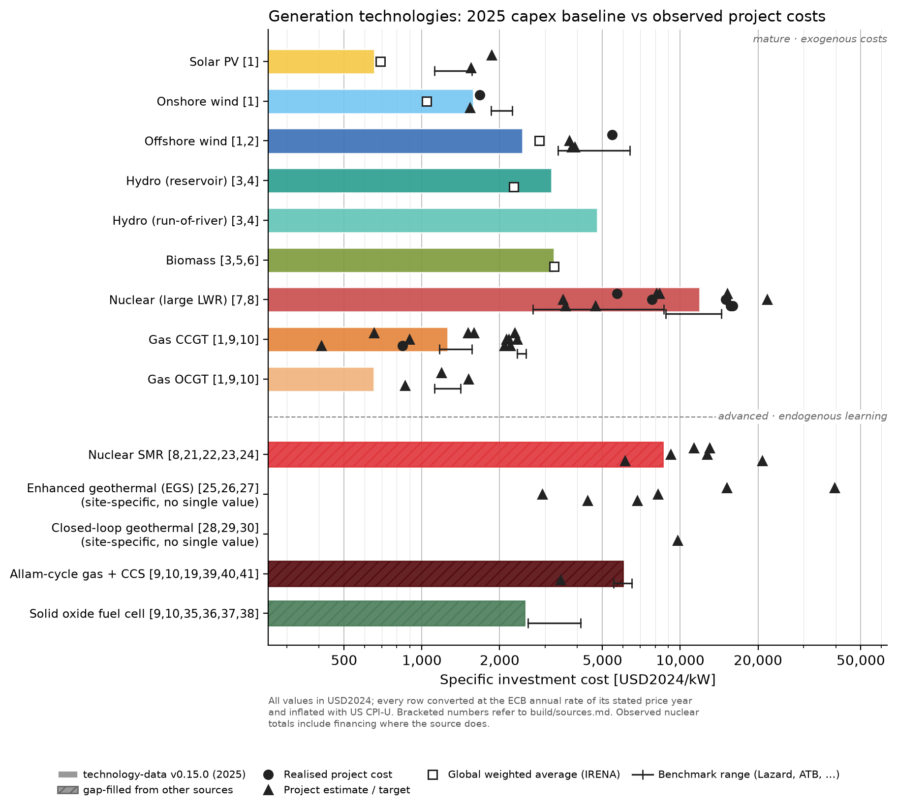

*Generation capex baseline (bars) against observed and estimated project costs (markers); storage, opex, LCOE and DAC figures are in `figures/`.*

```
data/technology-data/costs_2025_v0.15.0.csv    pinned download (committed; retrieve rule skips if present)
data/gap_fill.csv                               parameters technology-data lacks or gets wrong, with URL
data/observed_projects.csv                      flagship projects + benchmarks, with URL
config.yaml                                     palette, technology-data name mapping, CF bands, FX/CPI tables
  └─ compile_costs.py ─► build/costs_2025_compiled.csv   long: every parameter, original and USD2024 value, origin, source id
                         build/costs_2025_table.csv      wide: one row per technology incl. LCOE band
                         build/observed_normalised.csv   observed points in USD2024
                         build/sources.md                numbered source list (the [n] in the figures)
       └─ plot_costs.py ─► figures/capex_generation.{png,pdf}   USD/kW, generation (+ _mature bars-only, _advanced)
                           figures/capex_storage.{png,pdf}      USD/kWh and USD/kW, storage, ordered by duration (+ _mature, _advanced)
                           figures/opex.{png,pdf}               FOM USD/kW/a, VOM USD/MWh
                           figures/lcoe.{png,pdf}               USD/MWh over the CF band
                           figures/dac.{png,pdf}                USD/tCO2 (capex + FOM only)
                           figures/slides/<same>.{png,pdf}      16:9 layout (15.2 x 5.5 cm, legend right, no ids/footnote,
                                                                `plotting.slide_exclude` techs dropped) for the kickoff deck (../../beamer/2026-09-08)
data/learning/schmidt2018.xlsx                  Schmidt et al. 2017/2018 experience-curve dataset (figshare 7012202, CC BY 4.0; committed, retrieve rule skips if present)
  └─ retrieve_schmidt.py ─► data/learning/schmidt2018.csv, schmidt2018_published.csv   parsed observations + published regression parameters
data/learning/manual.csv                        hand-curated cost-vs-cumulative-capacity rows (IRENA, BNEF, IEA, Fervo, vendor points), with URL
data/learning/floors.csv                        material floor / reference lines, with URL
  └─ fit_learning.py ─► build/learning/<tech>.json, build/learning_rates.csv   experience-curve fits and statistics
       └─ plot_learning.py ─► figures/learning/<tech>.{png,pdf}                 one experience-curve figure per technology, slide-ready (see "Learning curves")
common.py                                       shared helpers: currency conversion, annuity, grid/footnote/save
```

Run from this directory with the priam-myopic pixi environment:

```bash
S=../../models/priam-myopic/.pixi/envs/default/bin/snakemake
$S -n        # dry run
$S -c1       # build everything
```

Scripts also run standalone (`python compile_costs.py`, `python plot_costs.py lcoe`,
`python plot_costs.py capex_storage --slide`, `python fit_learning.py vrfb`,
`python plot_learning.py vrfb`).

## Method

- **Currency.** Everything is expressed in USD2024 (`base_currency` and
  `base_currency_year` in `config.yaml`; EUR2023 works too, which is what the
  SOW quotes, e.g. 4,000 EUR/kW for the SMR breakthrough). Each row is
  converted at the ECB annual average rate of its stated price year, then
  inflated with the base currency's CPI:
  `v_base = v · fx[cur][y] / fx[base][y] · CPI[base][2024] / CPI[base][y]`.
  Tables and their sources (ECB, Eurostat, BLS, ONS, StatCan, World Bank for
  Japan) are in `config.yaml`. Learning-curve rows may set `fx_mode: constant`
  to deflate in their own currency first and exchange once at the base-year
  rate (used for the yen-denominated ENE-FARM series, see below). technology-data rows carry their own `currency_year` (v0.15.0
  inflates investment rows to 2025 while leaving FOM/lifetime at their original
  year); rows without one are taken as the base year and flagged in `note`.
- **Units.** technology-data mixes `EUR/kW`, `EUR/kW_e`, `EUR/kWel`,
  `EUR/MW`, `EUR/MWh`, `%/year` … `compile_costs.py` maps them to EUR/kW,
  EUR/kWh, EUR/kW/a, EUR/kWh/a, EUR/MWh, EUR/MWh_th and raises on anything
  unknown. FOM given as `%/year` is applied to the normalised investment of the
  same technology.
- **Precedence.** technology-data first; `data/gap_fill.csv` fills parameters
  that are missing, replaces them when its `note` starts with `OVERRIDE:`
  (used for Allam-cycle, whose upstream row is an explicit "own assumption,
  TODO"), or adds a component on top when it starts with `ADD:` (the SOFC on
  top of the technology-data electrolyser for the hydrogen store). The `origin`
  column and the hatching in the figures show which is which.
- **LCOE.** `annuity(r, n) = r / (1 − (1 + r)^−n)` at r = 7 % real (Lazard-style
  commercial WACC; priam-myopic uses a 2 % social rate, which would lower every
  bar), `LCOE(CF) = (annuity · capex + FOM) · 1000 / (8760 · CF) + VOM + fuel/η +
  p_CO2 · intensity · (1 − capture)/η`. The bar spans the capacity-factor band in
  `config.yaml` (high CF at the marker, low CF at the far end). Fuel prices are
  the technology-data 2025 rows (`gas`, `uranium`, `biomass`); CO2 price 0 by
  default. Storage has no LCOE here (capex per kWh and per kW instead); DAC is
  reduced to USD/tCO2 from capex + FOM at 90 % availability, excluding energy.
- **Observed points.** `data/observed_projects.csv` holds realised project
  costs, project estimates/targets, PPA or auction prices, IRENA global weighted
  averages and Lazard/NREL benchmark ranges, each with the price year and a URL.
  They go through the same currency conversion. Nuclear totals include
  financing where the source does; storage projects are total cost divided by
  energy or power capacity.

## Gap-fill choices (central values; ranges and alternatives in `data/gap_fill.csv`)

| Technology | Value used | Source |
|---|---|---|
| Nuclear SMR | 8,000 USD2022/kW overnight, FOM 136 USD/kW/a, 60 a, η 0.37 | NREL ATB 2024 Nuclear-Small (Moderate); DOE Liftoff FOAK median ~13,000 shown as a point |
| EGS | *no bar* (`bar: false`); indicative 13,508 USD2022/kW (deep EGS binary), FOM 226 USD/kW/a kept in the compiled table | NREL ATB 2024; flash 7,630, DOE Liftoff FOAK 14,700 and Fervo FOAK ~7,000 shown as points |
| Closed-loop geothermal | *no bar*; indicative 33,000 USD/kW "today" (modelled), FOM 1.5 %/a | DOE Liftoff Next-Gen Geothermal (Mar 2024); NREL Eavor-Loop 2.0 study |
| CO2 battery | 220 EUR2023/kWh, 10 h (→ 2,200 EUR/kW), RTE 0.75, 30 a; no FOM found | Energy Dome CEO (2023); Alliant project 300–450 USD/kWh as a point |
| SOFC | 3,250 USD2023/kW (Bloom product cost, not installed), η 0.59 LHV, 10 a, FOM 5 %/a PEM proxy; **no capture rate published → unabated** | Bloom Energy datasheets; DEA PEMFC proxy |
| Allam-cycle | **OVERRIDE** 6,170 USD2025/kW (NET Power Project Permian FOAK, $1.7–2.0 bn / 300 MW), FOM 2.5 %/a | NET Power Q4 2024 results; Xie et al. 2024 |
| Li-ion FOM | **OVERRIDE** 40 USD2023/kW/a | EIA/S&L AEO2025 case 19 (technology-data has inverter FOM only) |
| H2 tank + electrolyser + SOFC | energy: DEA 151a tank incl. compressor 68 EUR2025/kWh_H2 ÷ 0.59 SOFC efficiency = 127 USD/kWh_el (`energy_per_output: true`); power: technology-data AEC electrolyser 2,263 EUR2025/kW **ADD** SOFC 3,250 USD2023/kW; FOM 4 %/a of the sum (electrolyser rate as proxy); round trip 0.587 × 0.59 = 0.35 | technology-data; Thunder Said Energy / Bloom. Salt caverns (DEA 151c, 3.3 EUR/kWh_H2) would be ~20x cheaper but are geology-bound |
| Fusion | n/a | no published baseline (SOW) |

Geothermal is site-dependent, so it gets no single assumption bar: EGS and
closed-loop geothermal keep their observed points only (`bar: false` in
`config.yaml`), and conventional hydrothermal is not in the palette at all — in
the model these would be parametrised per site or supply-curve tranche (e.g.
NREL ATB's six geothermal resource classes), not as one national number.

Pumped hydro is equally site-specific, but PyPSA-Eur and PyPSA-Earth default
runs sidestep the question: PHS enters as fixed existing capacity from
powerplantmatching with `PHS_max_hours: 6` and is not in
`extendable_carriers`, so its capital cost never enters the optimisation.
PyPSA-Earth maps an extendable PHS to technology-data's PNNL 2022 rows
(`Pumped-Storage-Hydro-bicharger` powerhouse per kW, `-store` reservoir per
kWh), and that split is the bar here; technology-data's plain `PHS` row is a
2013 DIW placeholder identical to its reservoir-hydro value and is not used.
The observed points (Snowy 2.0, Fengning, Coire Glas, Hatta, Kidston,
Goldendale, ATB classes) show the site spread around it.

Storage rows are ordered by typical discharge duration within each group
(Li-ion 4 h, pumped hydro 6–20 h; then vanadium flow 4–10 h, CO2 battery 10 h,
iron-air 100 h, hydrogen 100+ h); the duration in the label is typical for the
technology, not a modelling assumption, except where the bar is derived from it
(CO2 battery power = 220 EUR/kWh × 10 h).

Vanadium flow batteries have observed points on the energy panel only. The
technology-data power bar is the PNNL 2022 "power equipment" component alone
(~190 USD2024/kW), whereas published per-kW project costs are total cost
divided by MW, i.e. exactly the per-kWh cost times the duration (PNNL 10 h,
Dalian 4 h). Those per-kW points duplicated the per-kWh points and were removed
so the panel compares like with like.

Gas CCGT with post-combustion CCS was dropped from the palette (Sep 2026): the
SOW names Allam-cycle CCS as the advanced gas option, and a second, exogenous
gas + CCS route would only compete with it for the same role.

## Learning curves (`figures/learning/`)

One figure per technology, made for slides: the classic double-log experience
curve (unit cost against cumulative installed capacity), the level fit with its
95 % confidence band, and one annotation with the inferred learning rate, its
95 % interval, the sample size and the doublings covered. Markers are coloured by
source, numbered as in the source line under each figure (clickable links on
the slides). Filled markers are
the fitted points. Hollow markers are **excluded** points: they are drawn so the
fitted series can be placed against everything else that was collected, but
the legend states why each group cannot enter the fit (a different scope such as
consumer cells or PV modules, a different capacity basis, a vendor target or
FOAK estimate with nothing deployed, a forecast). For storage technologies only
the component with data is drawn (energy for flow and Li-ion batteries, power
for the hydrogen store); Schmidt's derived series (a collected series divided
by a constant C-rate) are not drawn at all. The full statistics, sources,
material floors, reference bands and analogy assumptions are in the section of
each technology below, in the order of the slide deck
`beamer/2026-09-22-tech-cost-chat`, which includes these PDFs directly.

**Data.** `retrieve_schmidt.py` downloads the open dataset behind Schmidt,
Hawkes, Gambhir & Staffell, *Nat. Energy* 2017 (update of Aug 2018, figshare
7012202, CC BY 4.0) and parses it with the standard library (the pixi env has no
xlsx reader): 17 blocks, each a collected series plus a second series that is
the first divided by a constant C-rate. Those derived series are written with
`derived = True` and never fitted; the block's published `A, b, σ, ER` go to
`schmidt2018_published.csv` and the script asserts that our own log-log slope
reproduces the published `b` for every block. Schmidt's `σ` is the standard
error of `b` (our `se_b` matches it to four decimals). `data/learning/manual.csv`
adds hand-curated rows, every one with source, URL and price year: IRENA global
weighted-average total installed costs 2010–2024 for utility PV and onshore wind
(with IRENA cumulative capacity via Our World in Data), the BNEF turnkey 4 h
system price 2021–2025 with BNEF's cumulative stationary fleet, IEA's 2024
electrolyser cost survey, Fervo's eight horizontal EGS wells (El-Sadi et al.
2024 via Akindipe et al. 2025), the ENE-FARM residential fuel-cell unit prices
FY2009–2019 (PEFC and SOFC Type S) with cumulative shipments from the ACE
statistics, post-2017 flow-battery project points with China's deployment
(Project Blue), and the vendor / FOAK points for iron-air, CO2 battery,
Allam-cycle, SMR and closed-loop geothermal. `floors.csv` holds one material
floor (vanadium pentoxide content x USGS price), one reference line (BNEF
stationary pack price) and one reference band (US shale drilling cost per
foot); following Way et al. no floor is ever imposed on a fit.

Of the seven fitted series, two are Schmidt's (the utility flow-battery and
the alkaline-electrolyser series) and five were curated here (IRENA PV and
onshore wind, BNEF Li-ion systems, Fervo drilling, ENE-FARM SOFC). Schmidt
still supplies most of the *drawn* points (consumer Li-ion cells and EV packs,
PV modules, the Staffell & Green fuel-cell reconstruction), but all of those are
excluded for scope. `learning.not_fitted` in `config.yaml` holds the reason
printed for each excluded series; `learning.technologies.<key>.fit` selects
what is fitted.

**Statistics** (`fit_learning.py`, on the fitted series only):

- *Level fit* `ln c = a − b ln z` by OLS; experience rate `LR = 1 − 2^−b`;
  standard error, 95 % confidence interval (exact transform of the interval on
  `b`) and p-value against `b = 0` from the t distribution with `n − 2` degrees
  of freedom; R²; residual σ; a 95 % confidence band of the fitted line. This
  is the rate and interval printed on the figure.
- *First differences* `Δln c = −ω Δln z + η` on consecutive points without
  intercept, the stochastic Wright's law of Lafond et al. (2018) that Way et al.
  (2022) forecast with: `ω̂`, `σ̂ω = σ̂η / √Σ(Δln z)²`, `σ̂η` (residual std, the
  noise term of the Way forecasts) and the lag-1 residual autocorrelation `ρ₁`
  (Way fixes ρ = 0.19; we report it).
- *Time trend* `ln c = α − μ·year` (Moore's law) as a cross-check, with the
  Wright exponent it implies through the mean growth of `ln z` (`b = μ / g`).
- Flags: `no rate` (fewer than two fitted points), `n < 5`
  (`learning.min_points`) and `chained` (the fit pools several series).

All costs are in USD2024: converted at the ECB annual rate of the stated price
year and inflated with US CPI-U, or, for single-country series in a floating
currency (ENE-FARM in yen), deflated with the domestic CPI and exchanged once
at the base-year rate (`fx_mode: constant`) so the exchange rate cannot tilt the
slope. Converting the yen prices at each year's rate instead would inflate the
SOFC rate from 22 % to 30 % through the 2012–2015 yen depreciation alone.

Current fits (`build/learning_rates.csv`; regenerate with
`python fit_learning.py --summary`):

| Technology | Component | n | Years | Doublings | LR level (95 % CI) | LR first-diff. | Time trend /a | Published (Schmidt) | Flags |
|---|---|---|---|---|---|---|---|---|---|
| Enhanced geothermal (EGS) | drilling | 8 | 2022–2024 | 3.0 | 34 % [22, 45] | 21 % | 40 % |  |  |
| Vanadium flow battery (4–10 h) | energy | 5 | 2008–2017 | 6.2 | 13 % [8, 18] | 12 % | 9 % | 13.0±3% |  |
| Solid oxide fuel cell | plant | 9 | 2011–2019 | 3.8 | 22 % [18, 25] | 19 % | 11 % |  |  |
| H2 tank + SOFC (100+ h) | power | 6 | 1956–2014 | 3.0 | 18 % [9, 26] | 21 % | 1 % | 17.7±6% |  |
| Solar PV | plant | 15 | 2010–2024 | 5.5 | 33 % [31, 35] | 29 % | 14 % |  |  |
| Onshore wind | plant | 15 | 2010–2024 | 2.6 | 24 % [19, 29] | 24 % | 5 % |  |  |
| Li-ion battery (4 h) | energy | 4 | 2021–2024 | 2.7 | 19 % [-36, 51] | 20 % | 16 % |  | n < 5 |
| Nuclear SMR | plant | 0 |  |  |  |  |  |  | no rate |
| Iron-air battery (100 h) | energy | 0 |  |  |  |  |  |  | no rate |
| CO2 battery (10 h) | energy | 0 |  |  |  |  |  |  | no rate |
| Allam-cycle gas + CCS | plant | 0 |  |  |  |  |  |  | no rate |
| Closed-loop geothermal | plant | 0 |  |  |  |  |  |  | no rate |

### Enhanced geothermal (EGS)

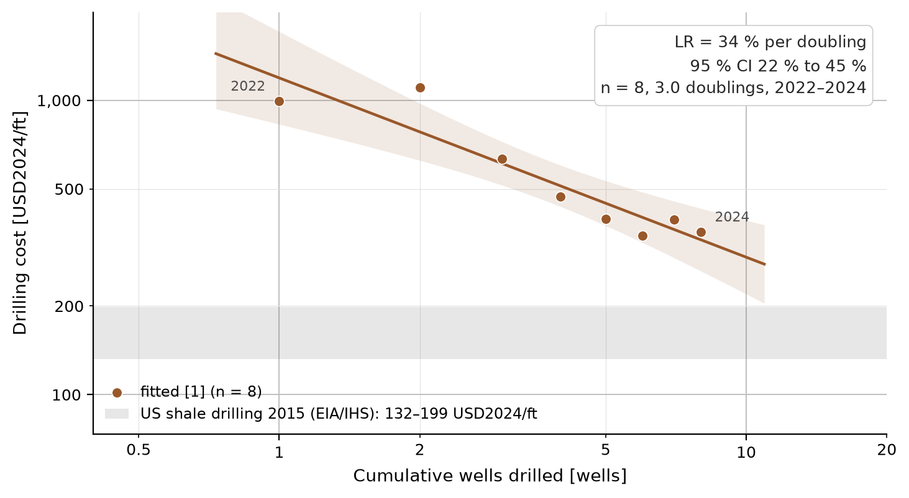

Sources in the legend: [1] [El-Sadi et al. (2024) via Akindipe et al. (2025)](https://pangea.stanford.edu/ERE/pdf/IGAstandard/SGW/2025/Akindipe.pdf)

*Sample.* Fervo's eight horizontal EGS wells 2022–2024 (Project Red 1–2 in
Nevada, Cape Station 3–8 in Utah): drilling cost per foot of total depth
against the cumulative number of horizontal wells Fervo has drilled, 3.0
doublings from a base of one well (El-Sadi et al. 2024, Stanford Geothermal
Workshop, as tabulated in Akindipe et al. 2025). It is the only cost-versus-
deployment series that exists for EGS; plant capex has FOAK points only (in
`data/observed_projects.csv`).

*Fit.* Level `b = 0.609 ± 0.100`, LR 34.4 % [22.3, 44.7], R² 0.86, p < 0.001,
matching the 35 % Fervo reports itself. First differences `ω̂ = 0.345`,
`σ̂ω = 0.274`, `σ̂η = 0.25`, LR 21 %, `ρ₁ = −0.32`: the step-to-step estimate is
much noisier because the gain is concentrated in wells 2 to 4. Time trend
40 % per year [17, 57].

*Reference (grey band).* US shale drilling cost per foot of total depth in
2015, five plays: 100 (Bakken) to 150 (Midland) USD2015/ft, i.e. 132–199
USD2024/ft (EIA, *Trends in U.S. Oil and Natural Gas Upstream Costs*, March
2016, Figure 4, IHS study; values read from the chart). Fervo's plateau of
350–390 USD/ft over wells 6 to 8 sits about twice above it; the gap is
hard-rock penetration rate and bit wear, the only part of the drilling cost
where EGS-specific learning is still possible.

*Why this does not contradict Way et al.* Way et al. (2022) see no long-run
decline in geothermal *plant* costs. This series is an intra-firm ramp-up of
one operator over two fields and two years: the gain came from importing shale
drilling practice (catch-up to a mature frontier), the last three wells have
flattened, drilling is roughly half of EGS capex, and resource quality declines
with deployment. It supports a geothermal-breakthrough scenario more than a
reference-case rate.

### Vanadium flow battery (4–10 h)

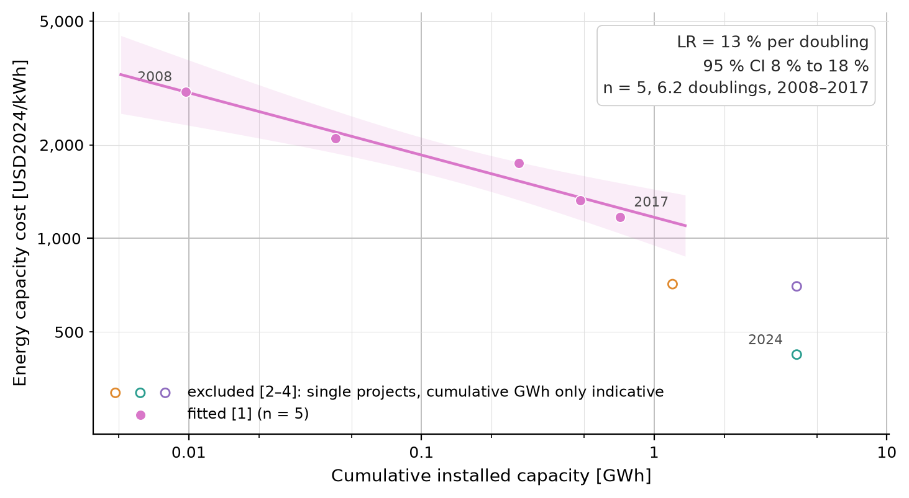

Sources in the legend: [1] [Schmidt et al. (2017), Nat. Energy; dataset update 2018](https://doi.org/10.1038/nenergy.2017.110) · [2] [Dalian Rongke 100 MW / 400 MWh, capacity via Project Blue (2025)](https://projectblue.com/blue/news-analysis/1389/hype-fades-as-the-future-of-vanadium-flow-batteries-grows-uncertain) · [3] [BNEF (2024) flow battery cost, China; capacity via Project Blue (2025)](https://projectblue.com/blue/news-analysis/1389/hype-fades-as-the-future-of-vanadium-flow-batteries-grows-uncertain) · [4] [BNEF (2024) flow battery cost, rest of world; capacity via Project Blue (2025)](https://projectblue.com/blue/news-analysis/1389/hype-fades-as-the-future-of-vanadium-flow-batteries-grows-uncertain)

*Sample.* Schmidt's utility vanadium redox-flow series 2008–2017, 5 system-scope
points over 6.2 doublings (capacity from the DOE Global Energy Storage Database;
prices from manufacturer quotes, Zhang 2014 and Lazard LCOS 2.0).

*Fit.* Level `b = 0.200 ± 0.025`, LR 13.0 % [8.0, 17.6], R² 0.96, p = 0.004;
reproduces the published 13 ± 3 %. First differences `ω̂ = 0.177`, `σ̂ω = 0.057`,
`σ̂η = 0.14`, LR 11.5 %, `ρ₁ = −0.61`. Time trend 9.4 % per year [3.3, 15.1],
implied `b = 0.207`.

*Excluded.* Three post-2017 project points (Dalian Rongke phase 1 2022; BNEF
2024 installed cost for China and for the rest of the world) at an indicative
cumulative capacity built from Schmidt's 0.71 GWh and Project Blue's China
additions (2018–2021 additions unknown). Chaining them onto Schmidt's series
would raise the rate to about 18 %, but they are single projects on a
different capacity basis.

*Floor (not drawn).* 67 USD2024/kWh of vanadium electrolyte: 5.6 kg V2O5 per
kWh (theoretical, Vanitec) at the USGS 2025 average Chinese V2O5 price for 2024
(5.45 USD/lb). The 2024 China point (423 USD/kWh) is six times the floor.

*Power component.* Only Schmidt's derived series (energy series divided by the
C-rate) exists; not drawn, no rate.

### Solid oxide fuel cell

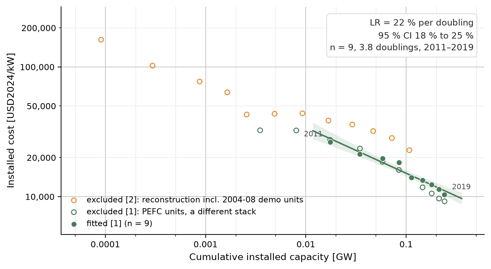

Sources in the legend: [1] [ACE ENE-FARM shipment statistics (2025) with ANRE unit prices](https://www.ace.or.jp/fc/m/DocFile/Org/20250117130901_29_DocFile1.pdf) · [2] [Schmidt et al. (2017), Nat. Energy; dataset update 2018](https://doi.org/10.1038/nenergy.2017.110)

*Sample.* Japanese ENE-FARM Type S (SOFC micro-CHP, Aisin/Kyocera/Osaka Gas)
unit prices FY2011–2019 from the ACE shipment statistics (ANRE prices,
equipment only, excluding installation and subsidy), 9 points over 3.8
doublings, against the cumulative shipments of the whole ENE-FARM programme
× 0.7 kW. PEFC and SOFC units share one supply chain and installer base, so the
programme total is the experience variable; a constant kW per unit cancels in
the slope. Yen prices are deflated with the Japanese CPI and exchanged once at
the 2024 rate.

*Fit.* Level `b = 0.352 ± 0.028`, LR 21.6 % [18.0, 25.1], R² 0.96, p < 0.001.
First differences `ω̂ = 0.311`, `σ̂ω = 0.076`, `σ̂η = 0.08`, LR 19.4 %,
`ρ₁ = −0.22`. Time trend 10.8 % per year [9.2, 12.4], implied `b = 0.349`.

*Excluded.* The PEFC series FY2009–2019 (a different stack; fitted on its own
it gives 20 % [15, 25] on the same basis) and Schmidt's Staffell & Green (2013)
reconstruction 2004–2015, which includes the 2004–2008 demonstration units and
installed rather than equipment prices.

*Caveats.* ANRE stopped surveying prices after FY2019, so the 2020–2024
shipments (to 541k units) carry no price. Bloom Energy (over 1 GW of
utility-scale SOFC) discloses no per-kW cost series. This figure contains no
electrolyser cost; the electrolyser is the next section.

### Hydrogen store: electrolyser (power component of H2 tank + SOFC)

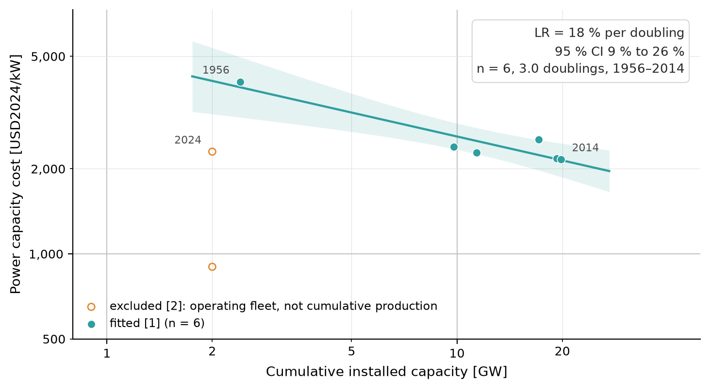

Sources in the legend: [1] [Schmidt et al. (2017), Nat. Energy; dataset update 2018](https://doi.org/10.1038/nenergy.2017.110) · [2] [IEA (2025), Global Hydrogen Review](https://iea.blob.core.windows.net/assets/12d92ecc-e960-40f3-aff5-b2de6690ab6b/GlobalHydrogenReview2025.pdf)

*Sample.* Schmidt's "Electrolysis (Utility)" series, alkaline electrolyser
plants 1956–2014, 6 points over 3.0 doublings. It covers the electrolyser half
of the store's power component only; the SOFC half has no series (the compiled
baseline sums an alkaline electrolyser and a Bloom SOFC), and the tank (energy
component) has cost points but no deployment series.

*Fit.* Level `b = 0.281 ± 0.052`, LR 17.7 % [9.0, 25.6], R² 0.88, p = 0.006;
reproduces the published 18 ± 6 %. First differences `ω̂ = 0.334`,
`σ̂ω = 0.093`, `σ̂η = 0.14`, LR 20.6 %, `ρ₁ = −0.43`. Time trend only 1.0 % per
year [0.2, 1.8]: the deployment grew by 0.04 ln-doublings per year over six
decades, so the rate per doubling is well identified but the rate per year is
small.

*Excluded.* IEA Global Hydrogen Review 2025 installed-cost midpoints for 2024
(2,300 USD/kW outside China, 900 USD/kW in China) at 2 GW: operating fleet, not
cumulative production, and survey midpoints rather than a series.

### Solar PV (mature reference)

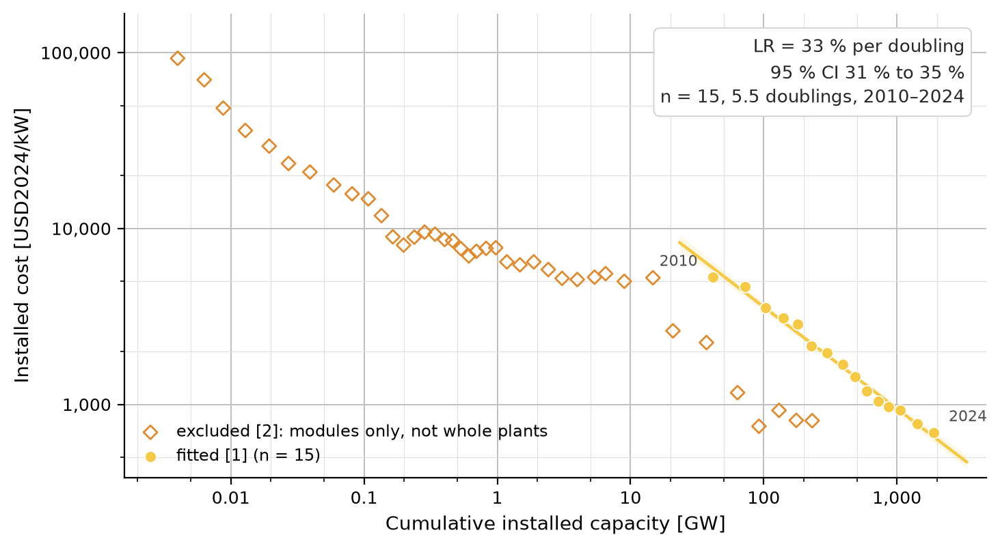

Sources in the legend: [1] [IRENA (2025), Renewable Power Generation Costs in 2024](https://www.irena.org/-/media/Files/IRENA/Agency/Publication/2025/Jul/IRENA_TEC_RPGC_in_2024_2025.pdf) · [2] [Schmidt et al. (2017), Nat. Energy; dataset update 2018](https://doi.org/10.1038/nenergy.2017.110)

*Sample.* IRENA global weighted-average total installed cost of utility-scale
PV commissioned in the year, 2010–2024 (Renewable Power Generation Costs in
2024, Figure 3.2), 15 points over 5.5 doublings, against total installed PV
(utility and distributed) at year end.

*Fit.* Level `b = 0.579 ± 0.016`, LR 33.1 % [31.4, 34.6], R² 0.99. First
differences `ω̂ = 0.487`, `σ̂ω = 0.075`, `σ̂η = 0.08`, LR 28.7 %, `ρ₁ = −0.44`.
Time trend 13.6 % per year [12.7, 14.4], implied `b = 0.535`.

*Excluded.* Schmidt's PV module series 1976–2015 (published 23 ± 2 %): modules
only, not whole plants. The plant-level rate since 2010 is steeper than the
module rate because balance-of-system costs fell alongside modules. Way et al.
fit LCOE rather than installed cost, which is why their exponent differs.

### Onshore wind (mature reference)

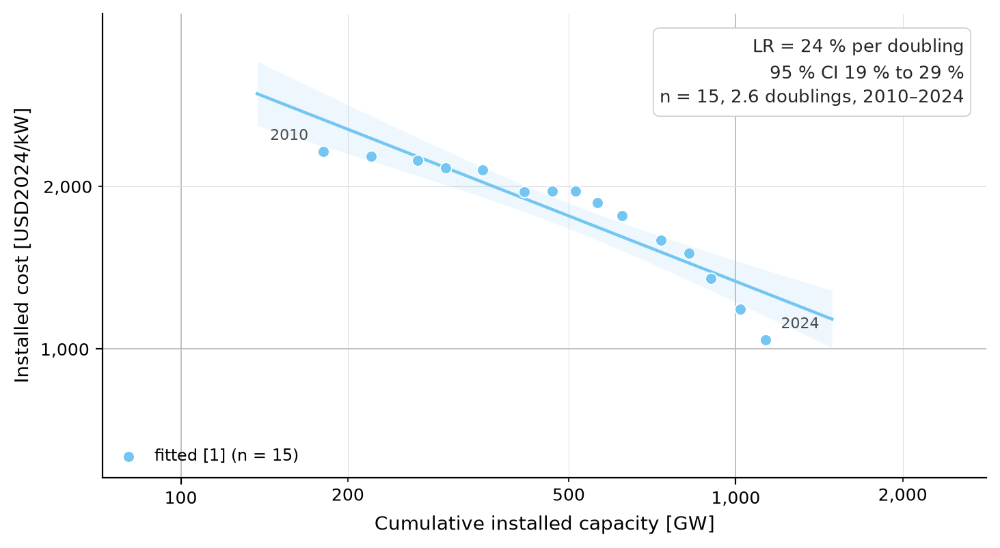

Sources in the legend: [1] [IRENA (2025), Renewable Power Generation Costs in 2024](https://www.irena.org/-/media/Files/IRENA/Agency/Publication/2025/Jul/IRENA_TEC_RPGC_in_2024_2025.pdf)

*Sample.* IRENA global weighted-average total installed cost of onshore wind
commissioned in the year, 2010–2024 (Figure 2.5), 15 points over 2.6 doublings,
against total installed wind (onshore and offshore) at year end.

*Fit.* Level `b = 0.403 ± 0.046`, LR 24.4 % [19.0, 29.4], R² 0.86. First
differences `ω̂ = 0.393`, `σ̂ω = 0.104`, `σ̂η = 0.05`, LR 23.8 %; `ρ₁ = 0.64`,
the one strongly autocorrelated residual series in the set (a 2015–2018
plateau followed by a steady decline). Time trend 5.1 % per year [4.1, 6.1].

### Li-ion battery (4 h, mature reference)

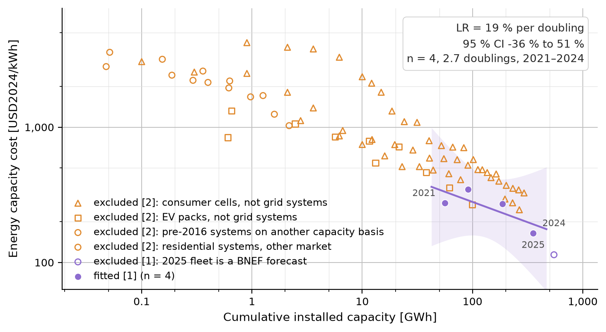

Sources in the legend: [1] [BNEF Energy Storage System Cost Survey (2021-2025)](https://about.bnef.com/insights/commodities/global-energy-storage-market-to-grow-15-fold-by-2030/) · [2] [Schmidt et al. (2017), Nat. Energy; dataset update 2018](https://doi.org/10.1038/nenergy.2017.110)

*Sample.* BNEF global average turnkey 4 h system price 2021–2024 against BNEF's
cumulative stationary fleet, 4 points over 2.7 doublings.

*Fit.* Level `b = 0.300 ± 0.172`, LR 18.8 % [−35.8, 51.4], R² 0.60, p = 0.22,
flagged `n < 5`: the 2022 supply-chain spike dominates four points. First
differences LR 20.4 % with `σ̂η = 0.34`. Time trend 16.4 % per year.

*Excluded.* Schmidt's consumer-cell series (published 21 ± 3 %, 30 ± 2 %,
19 ± 3 %), EV packs (9 ± 1 %, 19 %), residential systems (15 %) and the
2010–2016 utility systems (16 ± 4 %, on the DOE database rather than BNEF's
fleet, hence not chained), plus the BNEF 2025 price whose fleet value is a
BNEF forecast. Together these show that the series with a wide sample all
cluster at 15–20 % per doubling.

*Reference (not drawn).* BNEF Battery Price Survey 2025 stationary pack price,
70 USD/kWh (68 USD2024/kWh). The power component has only derived series and
is not drawn.

### Nuclear SMR

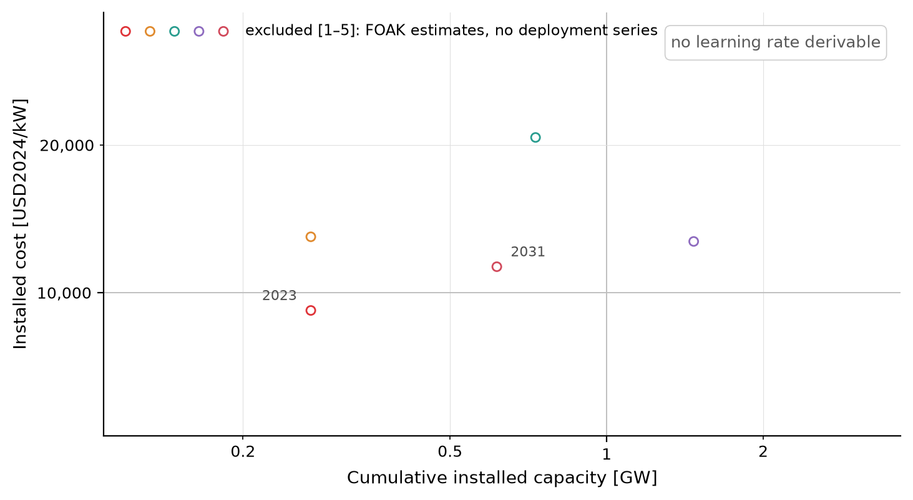

Sources in the legend: [1] [EIA AEO2025](https://www.eia.gov/outlooks/aeo/) · [2] [DOE Liftoff: Advanced Nuclear (2024)](https://gain.inl.gov/content/uploads/4/2024/11/DOE-Advanced-Nuclear-Liftoff-Report.pdf) · [3] [NuScale / UAMPS CFPP estimate (2023)](https://www.uamps.com/) · [4] [OPG Darlington BWRX-300](https://www.opg.com/) · [5] [TerraPower Natrium Kemmerer 1](https://www.terrapower.com/)

*Sample.* No cost-versus-deployment series exists. The five hollow points are
FOAK estimates (EIA AEO2025 6×80 MW; DOE Liftoff Advanced Nuclear FOAK median;
NuScale UAMPS CFPP before cancellation; OPG Darlington BWRX-300, four units;
TerraPower Natrium Kemmerer 1) placed at an indicative cumulative capacity
(the operating SMR fleet, Akademik Lomonosov and HTR-PM, plus the project);
the notes in `manual.csv` say how each x was set.

*Assumption for WP2 (not fitted).* 10 % per doubling as a scenario value. The
large-LWR record is negative to 6 % (Rubin et al. 2015); Lovering et al.
(2016) would be the natural analogue series, but its supplementary dataset is
not openly downloadable and was not transcribed.

### Iron-air battery (100 h)

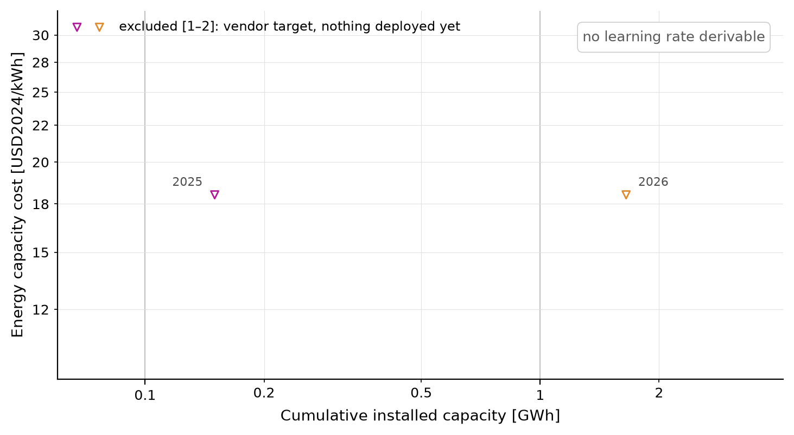

Sources in the legend: [1] [Form Energy (2023), modelling recommendations](https://formenergy.com/) · [2] [Form Energy (2023), vendor target](https://formenergy.com/)

*Sample.* No series. The two points are the midpoint of Form Energy's stated
all-in installed cost target (15–20 USD/kWh at 100 h, 2023 modelling
recommendations) placed at the first commercial projects (Great River Energy
Cambridge 1.5 MW / 150 MWh, 2025; Georgia Power 15 MW / 1,500 MWh, 2026). Not
an observed cost; no Form project has a disclosed price.

*Assumption for WP2 (not fitted).* 15 % per doubling; DOE LDES Liftoff (2023)
projects with 12–18 % per doubling.

### CO2 battery (10 h)

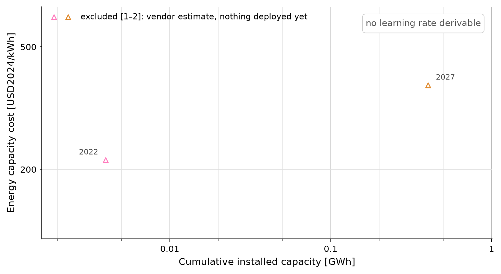

Sources in the legend: [1] [Energy Dome, CEO estimate](https://energydome.com/) · [2] [Alliant Columbia Energy Storage (Energy Dome)](https://www.alliantenergy.com/)

*Sample.* No series. Energy Dome's CEO estimate for first full-scale plants
(214 USD2024/kWh, placed at the 2.5 MW / 4 MWh Ottana pilot, 2022) and the
Alliant Columbia Energy Storage project (20 MW / 200 MWh, midpoint of 300–450
USD/kWh, 2027, at pilot plus Sardinia plus Columbia).

*Assumption for WP2 (not fitted).* 5 % per doubling for mechanical storage;
Schmidt's pumped-hydro series gives −1 ± 8 %.

### Allam-cycle gas + CCS

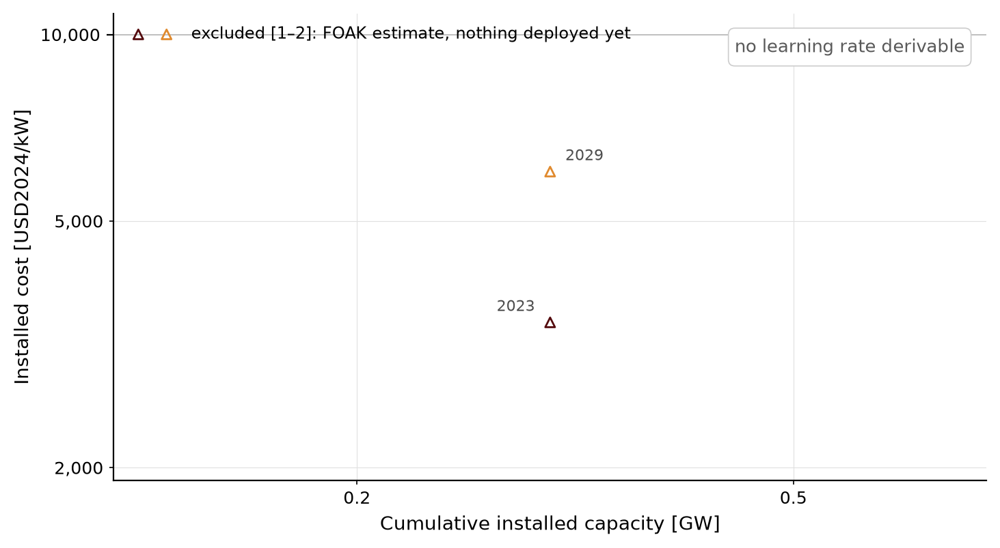

Sources in the legend: [1] [NET Power, Project Permian 2023 estimate](https://netpower.com/) · [2] [NET Power, Project Permian SN1 update](https://netpower.com/)

*Sample.* No series. NET Power Project Permian: the 2023 estimate (3,431
USD2024/kW) and the 2025 SN1 update (midpoint of USD 1.7–2.0 bn for 300 MW,
6,009 USD2024/kW, 2029 COD), both at the first utility-scale plant; the La
Porte 50 MWth demonstration (2018) has no disclosed cost.

*Assumption for WP2 (not fitted).* 5 % per doubling on the capex, following
2–7 % for CO2 capture units (Rubin et al. 2015); fuel sets the LCOE floor, so
capex learning matters less than for the storage technologies.

### Closed-loop geothermal

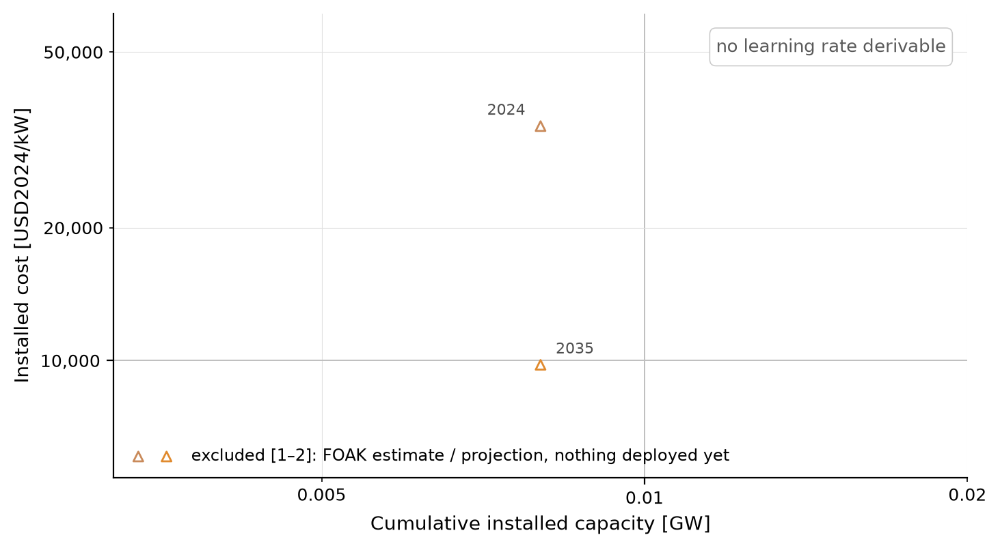

Sources in the legend: [1] [DOE Liftoff: Next-Gen Geothermal (2024), today](https://liftoff.energy.gov/) · [2] [DOE Liftoff: Next-Gen Geothermal (2024), 2035 pathway](https://liftoff.energy.gov/)

*Sample.* No series. DOE Liftoff Next-Generation Geothermal (March 2024)
modelled "today" cost (33,970 USD2024/kW) and its 2035 ambitious pathway
(9,780 USD2024/kW), both at Eavor's Geretsried commercial pilot (8 MW). The
second point is a projection, not an observation; no rate and no analogy
assumption is proposed here.

## technology-data caveats

- `SMR` / `SMR CC` in technology-data are **steam methane reforming**, not small
  modular reactors; the script asserts they are never mapped.
- `fuel cell` is a low-temperature PEM CHP unit, not an SOFC.
- `geothermal` has FOM and lifetime but no investment cost in the 2025 file
  (not used: hydrothermal is out of the palette).
- `allam` is flagged upstream as "Own assumption. TODO" and is overridden.
- `iron-air battery` is Form Energy's *target* cost, not an observed one; no
  Form project has a disclosed cost, and Energy Dome's US project only
  discloses a range, so the two LDES newcomers rest on vendor statements.
- v0.15.0 vs v0.13.3 differences in investment rows are inflation
  (currency_year 2020/2023 → 2025), not cost changes.

## Sources

See `build/sources.md` after a run; the same numbers appear in brackets in the
figure labels. Hand-curated inputs carry the URL in their own row.
