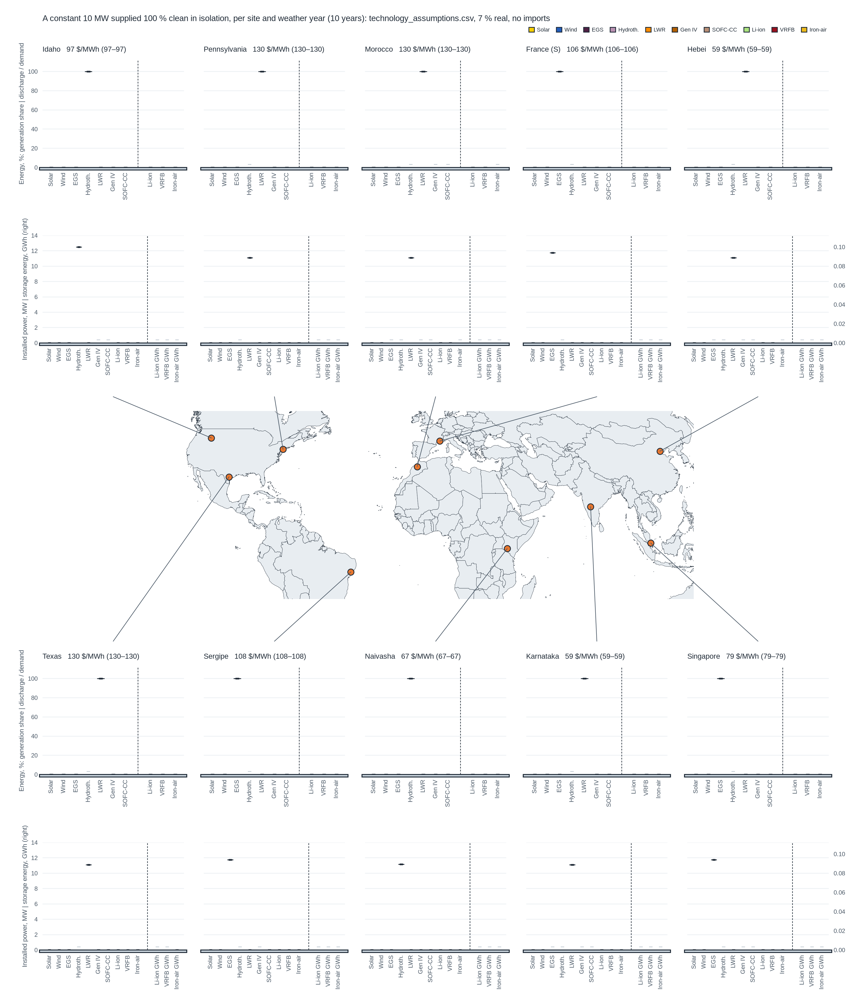

# Toy model of clean procurement: what the technology assumptions imply, site by site, weather year by weather year

A quick, repeatable projection of what the project's techno-economic input
([`technology_assumptions.csv`](../../config-pypsa-earth/technology-assumptions/technology_assumptions.csv))
implies when a buyer has to be supplied 100 % clean on its own: **a constant 10 MW of demand** (87.6 GWh/a, the
24/7 buyer's flat profile) at each of the ten sites of [`../weather-years`](../weather-years/README.md), for
each ERA5 weather year 2014–2023, one greenfield one-node PyPSA capacity expansion with hourly resolution, and
a figure that shows the energy mix (shares) and the installed capacities (MW, storage energy in GWh) per site
as violins over the weather years. Every number comes from the CSV; change a number there and `snakemake`
reruns the optimisations and the figure.



## What the current CSV implies (run of 2026-10-07, constant 10 MW, bus-average resources, nuclear min_load 0.5)

With a flat 10 MW load every site is served by a single firm plant in every weather year, with no solar, no
wind and no storage, so the violins collapse to points: LWR 11.1 MW (10 / 0.9) at Hebei and Karnataka (59
$/MWh), Pennsylvania, Texas and Morocco (130 $/MWh); EGS 11.8 MW at Idaho, France (S), Sergipe and Singapore
(97–108 $/MWh); hydrothermal 11.2 MW at Naivasha (67 $/MWh). This is the economics, not a bug: the firm plant
has to be sized for the night anyway, and once built it supplies the day at its fuel cost (11 $/MWh for LWR,
0 for geothermal), which solar at 50 $/MWh cannot undercut; a renewables-plus-storage supply of the same flat
load costs 176 $/MWh at Texas and 156 at Hebei with the bus-average resources (Texas: 64 MW solar, 26 MW
wind, 12 MW / 0.08 GWh Li-ion, 6 MW / 0.57 GWh iron-air). Under the earlier bus-shaped demand, solar took
7–30 % because the daytime peak sat above the night level; a flat load removes that niche. Weather enters
only once variable renewables are in the mix, i.e. when their cost with storage falls below the firm plant's
LCOE or the demand has a daytime peak (`demand.kind: bus` keeps the site's 2013 load shape at a 10 MW mean).
The procurable-resource profiles being fetched by `../weather-years/fetch_and_rebuild.sh` will lower the
renewables side (wind 0.35 instead of 0.20 at Pennsylvania); the figure updates automatically after each
fetch stage. Earlier variants are kept in `build/`: `results_local_resource.csv` (bus-shaped demand, per MWh)
and `results_free_dispatch.csv` (the same without the nuclear minimum load).

## Method

**The system.** One bus, a constant 10 MW load (config `demand`; `kind: bus` instead uses the site bus's
2013 load shape at a 10 MW mean), no imports, no load shedding, no existing capacity, no CO₂ price: every
technology is built from zero at the annualised cost of the CSV (7 % real discount rate, the LCOE convention
of the assumptions document; `capital_cost = capex × annuity(7 %, lifetime) + FOM`, `marginal_cost = VOM +
fuel / efficiency`). The geothermal supply-curve caps are the real GW of the cells within 250 km, which a
10 MW buyer never exhausts, so EGS enters at its cheapest tranche. Solver: Gurobi barrier, one problem of
8760 h per site and weather year, a few seconds each.

**The palette** (`config.yaml` `palette`; `techs.py` refuses to run if a CSV row is in neither `palette` nor
`excluded`, so a new row has to be placed on purpose):

| CSV row(s) | in the model | what varies by site |
|---|---|---|
| `solar-utility`, `onwind` | generator with the weather year's hourly capacity factor | the weather |
| `egs` | one capped generator per CAPEX tranche of the EGS cells within 250 km of the site (`../geothermal/build/egs_potential.csv`: CAPEX, FOM, CF 0.85, 30 a per cell; bins 6–8, 8–10, 10–12, 12–15, 15–20 k$/kW; `../pareto/techs.py::egs_tranches`); the CSV row is the Cape Station reference | the supply curve: cheapest cell Singapore 5,400 (conduction model over Sumatra, see caveats), Idaho 7,050, France S 7,650, Sergipe 7,960, Kenya 8,530, Hebei 9,400, Morocco 9,800, Texas 11,900, Pennsylvania 15,800, Karnataka 18,500 $/kW |
| `geothermal` | identified hydrothermal systems within 250 km as one capped generator (`hydrothermal_sites.csv`, all statuses; plants without a cost class take the country's flash-plant cost) | Kenya: 28 Rift Valley plants, 2.5 GW at ~4,900 $/kW; Idaho: 124 MW; nothing elsewhere |
| `nuclear-lwr-cnin`, `nuclear-lwr-row` | one `nuclear-lwr` generator, CF 0.9; the row is picked by the site's country | China, India 3,150 $/kW; everyone else 11,000 |
| `nuclear-gen4`, `sofc-cc` | firm generators at CF 0.9 with fuel and VOM from the CSV (SOFC with capture counts as clean here, decided 2026-10-07) | — |
| `battery-liion`, `vrfb` | Store + charger / discharger links, power and energy sized freely; FOM split between power and energy at the CSV's reference duration; VRFB efficiency 0.806 read as per direction (round trip 0.65, the CSV README's caveat) | — |
| `iron-air` | the same with energy = 100 h × power (`duration_h`) | — |
| `offwind` | **excluded**: no site profile; the document's offshore convention (onshore CF over shallow sea) would only clone onwind at a higher cost | |
| `hydro`, `ror`, `PHS` | **excluded**: existing fleet only in the study, nothing to build greenfield | |
| `biomass` | **excluded**: no site-level feedstock potential, unlimited biomass would be a cheap firm resource everywhere (decided 2026-10-07) | |
| `CCGT`, `OCGT`, `sofc` | **excluded**: unabated fossil | |
| `co2-battery` | **excluded**: `in_default_mix = no` (VRFB is in on request) | |

**The figure.** A 4 × 5 grid of axes around the sites' map: five sites above the map (the northernmost
five), five below, each site a column of two axes tied to its marker by a short straight connector (column
order per band chosen over all permutations: no crossings, then the shortest lines). Row "Energy": one violin
per generation technology (share of the generation delivered to the bus, %), a dashed separator, one violin
per storage technology (energy discharged, % of annual demand). Row "Capacity": installed power in MW for every
technology, generators and storage discharge power alike, the separator, then the storage energy capacities in
GWh on the right-hand scale. Each violin spans the ten weather years (ink dots =
the years, ink tick = the median); "–" marks a technology never built at that site. The column title carries
the median and range of the system LCOE. Colours are the PyPSA-Eur default `tech_colors` (solar, onwind,
nuclear, li-ion, iron-air, vanadium verbatim; EGS and hydrothermal from its geothermal entries, SOFC-CC from
`allam`, Gen IV a darkened nuclear), the rest of the look is the repo's icon plot style.

**Dispatch of the firm plants.** Firm technologies dispatch between `min_load` × capacity and the CSV
capacity factor (0.9) at their marginal cost (fuel / efficiency + VOM). Nuclear (LWR and Gen IV) carries
`min_load: 0.5` (decided 2026-10-07): a minimum stable output of 50 %, between France's routine 30–100 %
load following and the 50–100 % band of the fleet-wide operating experience (SNETP factsheet 7), and the
usual choice of unit-commitment capacity-expansion studies. It changes little: the optimiser keeps the
cheap Chinese / Indian LWR cycling between 50 and 90 % of capacity around midday solar (Hebei capacity
factor 0.61 with the minimum, 0.59 without; Karnataka 0.74; the US sites 0.77–0.78), the "flexible base"
mode of Sepulveda et al. 2018, and system costs move by under 1 %. The free-dispatch variant is kept in
`build/results_free_dispatch.csv` / `summary_free_dispatch.csv`. SOFC-CC stays free (fuel cells modulate). Ramp limits (5 %/min) do not
bind at hourly resolution. "Firm" in the Sepulveda et al. 2018 sense means available on demand in all
seasons, not baseload.

## How to run

```
Snakefile
  ├─ run      run_site_year.py (build_network.py, techs.py)  ─►  build/runs/<site>/<year>.csv   one row per technology
  ├─ collect                                                 ─►  build/results.csv
  └─ plot     plot_overview.py                               ─►  figures/overview.{png,pdf}, build/summary.csv
```
```bash
../../models/priam-myopic/.pixi/envs/default/bin/snakemake -c8     # from this directory; ~5 min; Gurobi licence at ~/gurobi.lic
```
Inputs: `../weather-years/build/profiles_siteyears.nc` (build it first), `../geothermal/build/*.csv` and the
assumptions CSV, all declared as Snakemake inputs so a change reruns what depends on it. Standalone:
`python build_network.py ke-naivasha 2019` prints one run; `python techs.py` prints the technology table
for a US and an Indian site and the geothermal tranches at Idaho and Naivasha.

Per-run CSV columns: `key, site, year, tech, row` (the CSV row used), `label, group, kind, model,
capex_power_used, capex_energy_used` (for tranches: the USD/MW/a actually paid, averaged over the built
tranches), `p_nom_mw` (generators; the discharger for storage), `e_nom_mwh, energy_mwh` (delivered to the
bus), `energy_in_mwh, curtailed_mwh, fixed_cost, var_cost, tranches, system_cost, demand_mwh, peak_mw,
lcoe_usd_mwh`. `build/summary.csv`: median / min / max over the weather years of the three plotted
quantities (`energy_pct`, `p_nom_mw`, `e_nom_gwh`) per site and technology. The number of weather years grows
while `../weather-years/fetch_and_rebuild.sh` fetches them breadth-first (three per location per stage); the
Snakefile takes the years from the dataset.

## Caveats

- Demand has the same shape in every weather year (no temperature coupling): the violins show weather
  variability of supply only.
- EGS outside the continental US comes from the smooth Lucazeau conduction model (`t_source` in
  `egs_potential.csv`), which is why Singapore sees 5,400 $/kW cells (Sumatra's volcanic arc within 250 km):
  treat cheap non-US EGS as indicative. The nine-cell weather stencil stands in for whole cluster regions
  or countries (Morocco, Kenya, Singapore are one-node countries in PyPSA-Earth).
- Wind and solar profiles are the site's *procurable* resource (the best bus of its own grid, or a documented
  resource point for the one-node countries, see `../weather-years/README.md`), not the cluster-average
  resource at the load bus; transmission between the two is not costed. The first run of 2026-10-07 used
  the bus-average profiles (kept as `build/results_local_resource.csv`), under which LWR at 11,000 $/kW took
  80–90 % at Texas and Pennsylvania because their local wind sat at 0.20–0.28 against 0.35 in the grid.
- No offshore wind, no hydro, no biomass, no transmission to neighbours: an isolated clean slate, not a
  forecast. 100 % clean admits SOFC with capture (≈ 10 % residual emissions).
- Storage FOM is split between power and energy at the CSV's reference duration; the CSV gives one FOM per
  kW at that duration.
