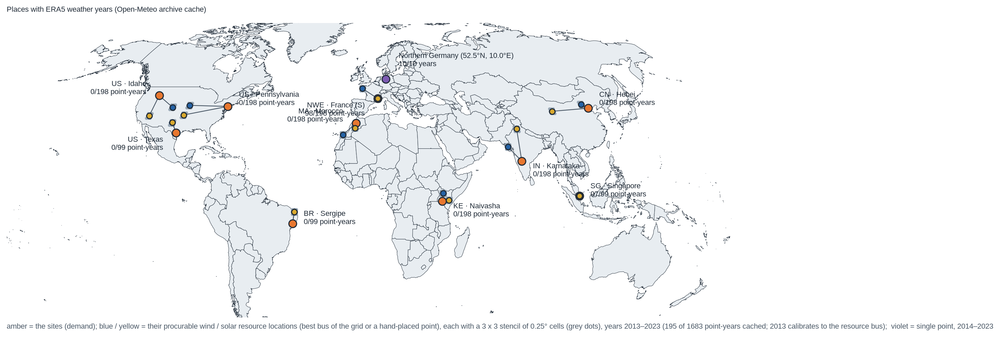

# Weather years: hourly wind, solar and demand series for the one-node toy models

The weather-year datasets of the project and the tools that build them, pulled out of
[`../fourier`](../fourier/README.md) (2026-10-07) so that the data has one home and the analyses
([`../fourier`](../fourier/README.md), [`../pareto`](../pareto/README.md),
[`../toymodel-clean-procurement`](../toymodel-clean-procurement/README.md)) only read it.



## Datasets (all `build/`, gitignored; rebuilt with one `snakemake` call)

| file | content |
|---|---|
| `profiles_siteyears.nc` | **the ten sites × ten ERA5 weather years 2014–2023 = 100 series** `"<site> · <year>"`: `cf_wind`, `cf_solar`, `demand_mw`, hourly, 8760 h per year (leap days dropped, nominal non-leap calendar), local solar time; coordinates `site`, `year` on `series` |
| `siteyears.csv` | one row per series: key, site, year, region, bus, x, y, utc_offset_h, mean CFs, load_twh, calibration factors |
| `profiles_sites.nc`, `sites.csv` | the sites' 2013 PyPSA-Earth bus profiles (same variables): the demand shape of every weather year and the calibration target |
| `profiles_years.nc`, `years.csv` | one place, Northern Germany (52.5°N, 10.0°E), weather years 2014–2023; demand = the nearest NWE bus (DE0 4, 43 TWh/a) in every year |
| `siteyears_calibration.csv`, `siteyears_2013.nc` | calibration factors and the 2013 agreement of the stencil mean with the bus profile, drawn in `figures/siteyears_validation.png` |

Series are in **local solar time** (shift by round(lon/15) h, circular over the year) so diurnal peaks line
up across continents. **Demand is the bus's 2013 profile in every weather year**: the variability in the
datasets is weather variability only (no temperature-driven demand, no growth).

## The sites and their procurable resources (`config.yaml` `sites`, decided 2026-10-07)

Each site is a PyPSA-Earth bus whose 2013 load is the demand. Its wind and solar are **not** the bus's own
cluster-average resource but the resource a buyer in that grid could procure: the best bus of the site's own
grid by 2013 capacity factor (`rank_resource_buses.py` → `build/resource_ranking.csv`; the US split into
ERCOT, Eastern and Western interconnections; tiny coastal buses with under 1 GW of potential skipped), or a
hand-placed point for the one-node countries, with a documented fleet capacity factor as the wind calibration
target. The change was made because the bus-average profiles (kept as `build/profiles_siteyears_local.nc`)
sat far below what the grids offer: Pennsylvania wind 0.20 against 0.35–0.50 in the Eastern interconnection,
Sergipe 0.16 against 0.32 on Brazil's north-east coast, Morocco and Kenya national averages of 0.20 and 0.26
against 0.4–0.6 at Tarfaya and Lake Turkana.

| key | site (demand bus) | load 2013 TWh | wind from | CF 2013 | solar from | CF 2013 |
|---|---|---|---|---|---|---|
| us-idaho | US · Idaho, US `US0 28` | 39.6 | Colorado Front Range `US0 7` (Western) | 0.34 | Nevada `US0 38` | 0.19 |
| us-texas | US · Texas, `US0 33` | 84.0 | West Texas `US0 13` (ERCOT) | 0.36 | West Texas `US0 13` | 0.18 |
| us-pennsylvania | US · Pennsylvania, `US0 29` | 324.7 | Iowa `US0 11` (Eastern) | 0.35 | Oklahoma `US0 2` | 0.16 |
| fr-south | NWE · France (S), `FR0 7` | 32.8 | Brittany `FR0 0` | 0.34 | the site bus | 0.14 |
| ma | MA · Morocco, AFR `MA._AC` (country node) | 56.0 | Tarfaya (27.93 N, 12.93 W), target CF 0.38 (301 MW, ~1 TWh/a) | — | Ouarzazate (30.9 N, 6.9 W), raw | — |
| ke-naivasha | KE · Naivasha, AFR `KE._AC`; site at the Olkaria field (36.30 E, 0.90 S) | 14.8 | Lake Turkana (36.80 E, 2.58 N), target CF 0.55 (310 MW, ~1.5 TWh/a) | — | Garissa (39.65 E, 0.45 S), raw | — |
| br-sergipe | BR · Sergipe, `BR0 29` | 10.6 | Rio Grande do Norte `BR0 18` | 0.32 | Rio Grande do Norte `BR0 18` | 0.16 |
| in-karnataka | IN · Karnataka, `IN0 34` | 47.2 | Gujarat `IN0 13` | 0.22 | Punjab `IN0 10` | 0.18 |
| cn-hebei | CN · Hebei, `CN0 24` | 423.3 | Hebei north `CN0 40` | 0.34 | Qinghai `CN0 8` | 0.20 |
| sg | SG · Singapore, SG `0` (one node) | 66.4 | the site bus | 0.05 | the site bus | 0.13 |

Six sites survive fourier's data-driven uncorrelated selection (Tennessee, France (N), Rajasthan and Rio
Grande do Sul were dropped); Morocco, Kenya, China and Singapore were added by hand. The stage networks come
from the catalyst fork of PyPSA-Earth (`../../config-pypsa-earth/README.md`): clustered buses for US, NWE, BR,
IN, CN; one node per country in SG and AFR. Transmission between the demand bus and the resource bus is not
costed: the dataset answers "what could a buyer in this grid contract", not "what sits next to the load".

## How it is built

```
Snakefile
  ├─ rank_resource_buses.py ─►  build/resource_ranking.csv            every bus by wind / solar CF (the basis of the config's resource choice)
  ├─ extract_bus_profiles.py ─►  build/profiles_sites.nc, build/sites.csv   2013 site-bus load + resource-bus onwind / solar p_max_pu
  ├─ sample_points.py (checkpoint) ─►  build/siteyears_points.csv           3 × 3 ERA5 cells per resource location (0.25° grid, 1° spacing)
  │    └─ retrieve_weather.py ─►  data/openmeteo/pt_<lat>_<lon>_<year>.csv   one file per cell and year 2013–2023 (990, gitignored)
  │         └─ build_siteyears.py ─►  build/profiles_siteyears.nc + siteyears.csv + siteyears_calibration.csv + siteyears_2013.nc
  │                                    (wind from the wind location, solar from the solar location, demand from the site bus)
  │              └─ plot_siteyears_validation.py ─►  figures/siteyears_validation.{png,pdf}
  ├─ retrieve_weather.py ─►  data/openmeteo/northern-germany_<year>.csv (tracked)
  │    └─ build_years.py ─►  build/profiles_years.nc, years.csv, years_correlation.csv
  └─ plot_sites_map.py ─►  figures/sites_map.{png,pdf}
convert.py   shared weather → capacity-factor conversion (wind_cf, solar_cf, drop_leap, anomaly)
```

```bash
../../models/priam-myopic/.pixi/envs/default/bin/snakemake -c1 --rerun-triggers mtime   # from misc-quarter1/weather-years, priam-myopic pixi env
```
Always pass `--rerun-triggers mtime`: with Snakemake's default triggers an edit of `retrieve_weather.py` or of
the stencil parameters marks every cached point-year as outdated, and Snakemake deletes and refetches the
files (990 downloads, a day and a half of quota). Every script also runs standalone (`python build_siteyears.py`).

**Weather.** Hourly ERA5 at the point from the Open-Meteo archive API (`models=era5`, free, no key): 100 m
wind speed, GHI, DNI, DHI (means of the preceding hour) and 2 m temperature, UTC. Wind: the speed through a
3 MW-class power curve (`years.wind_turbine`, cut-in 3 m/s, rated 13 m/s, cut-out 25 m/s), one turbine, no
fleet smoothing. Solar: fixed 35° tilt, equator-facing, plane-of-array irradiance from DNI·cos(AOI) +
isotropic diffuse + ground reflection (albedo 0.2) with a compact NOAA-style solar position at the middle of
each hour, cell temperature via NOCT 45 °C, −0.35 %/K, 90 % system efficiency (`convert.py`).

**Site-years.** Nine ERA5 cells per resource location: a 3 × 3 lattice centred on the wind or solar location
with 1° spacing, snapped to the 0.25° ERA5 grid (`sample_points.py`; `cell_selection=land` moves a sea cell
to the nearest land cell). Capacity factors are computed per cell and averaged, which gives part of the fleet
smoothing of the bus-aggregated PyPSA-Earth profiles. The remaining level bias is removed on the overlap year
2013 against the resource bus's profile in `build/profiles_sites.nc`: for wind one factor on the 100 m wind
speed per location, found by bisection within `speed_factor_range` so that the 2013 stencil-mean CF equals the
bus mean (a speed factor keeps the calm spells and the shape of the duration curve, a CF factor would clip at
1); for solar one factor on the capacity factor (close to 1). A hand-placed wind point is calibrated to its
documented fleet `target_cf`, a hand-placed solar point not at all. **The factor is one scalar per location
fitted on 2013 only and applied unchanged to 2014–2023, so the year-to-year differences of the means are
preserved** (e.g. West Texas wind varies by ±10 % around its mean across the ten years); it corrects the
systematic level bias of ERA5 100 m point wind through a single turbine curve against atlite's fleet
aggregate, not the weather. 2013 itself is not stored as a weather year. `build/siteyears_calibration.csv` and
`figures/siteyears_validation.png` report the 2013 agreement (hourly and daily correlation, RMSE,
standard-deviation ratio, share of calm hours), raw and calibrated: the correlation is below 1 by
construction (nine cells against a potential-weighted aggregate of the whole cluster region, a different
power curve), the mean is matched exactly. The PyPSA-Earth cluster polygons are never used: for US, BR and
IN their bus names are permuted against the clustered network (`../../config-pypsa-earth/README.md`), so a
lattice around the bus coordinate, consistent with the profiles (the solar peak sits at local noon under
it), is the robust choice.

**Open-Meteo quota.** Free tier: 600 calls/min, 5,000/h, 10,000/day; one point-year of five hourly
variables weighs 13 calls, so the full 990 point-years are two calendar days. `retrieve_weather.py` waits
out the minutely / hourly limits and stops on the daily limit; rerun the next day, cached files are skipped.
`snakemake --keep-going` lets the other points continue after a failed one.

## Caveats

- Nine cells on a fixed 2° × 2° lattice stand in for cluster regions that are 3–10° wide (Idaho,
  Pennsylvania, Hebei) or for whole countries (Morocco, Kenya), so the hourly correlation with the bus
  profile in 2013 is well below 1 and the stencil mean is spikier than the aggregate; one calibration
  year; the wind-speed factor also absorbs power-curve and hub-height differences; the 2013 Open-Meteo ERA5
  and the 2013 cutout are the same reanalysis, so 2013 is a shape check, not an independent validation.
- Weak wind matches (2013 hourly correlation of the calibrated stencil mean with the bus): Naivasha 0.41
  (speed factor 2.15: the national profile is dominated by Lake Turkana, the stencil sits on the Rift),
  Hebei 0.45 (factor 1.55, a cluster region far larger than the stencil), Idaho 0.55 (factor 1.89, raw
  stencil CF 0.02 in the mountain valleys), Morocco 0.66 (factor 1.54); the others are 0.87–1.00. Singapore's
  national wind CF is 0.05, there is no useful wind at the point either.
- As of 2026-10-07 three point-years are still missing (France (S) 2023, Singapore 2013 and 2023, Open-Meteo
  daily quota): those series are the mean over eight stencil points (`siteyears.csv` `n_points`), and
  Singapore's calibration used eight points. Fetch them and rebuild (the outputs exist, so force the rule) with
  `snakemake -c1 --rerun-triggers mtime -R build_siteyears`, then rerun `../toymodel-clean-procurement`.
- Kenya: the stencil sits on the Olkaria field, the demand and the calibration target are the national
  node (KE._AC at 36.76, −0.84), 60 km away.
- ERA5 point wind at 100 m is biased low over land and an unsmoothed single-turbine curve is spikier than a
  fleet; the PV model is simple (no spectral, soiling or inverter-clipping effects).
- Demand is the synthetic GEGIS SSP2-2.6 2030 profile that PyPSA-Earth distributes over buses by GDP and
  population: buses of one country share a demand shape, the weekly pattern is stylised, the German
  profile has visible step changes in April and November. It is reused unchanged for every weather year.
